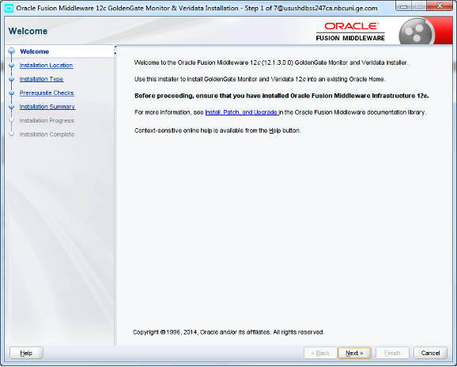
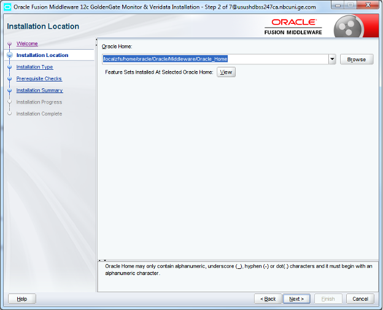
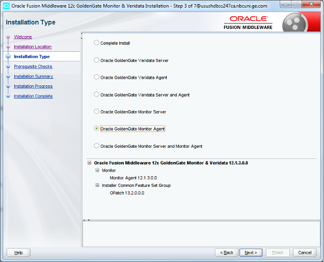
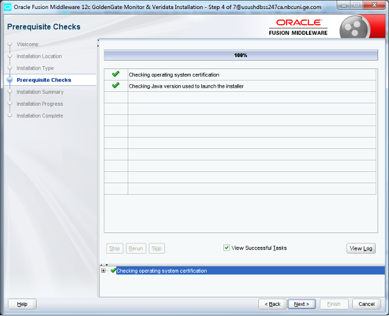
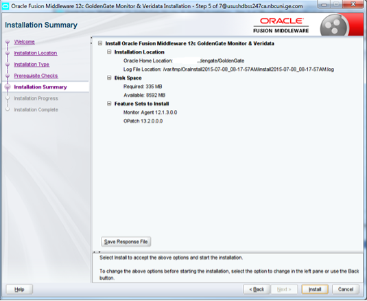
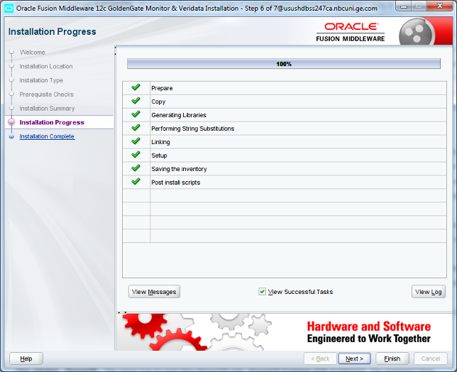
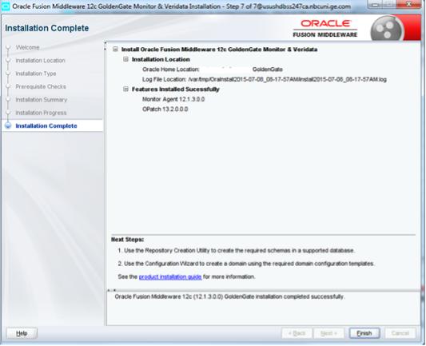

The Oracle&reg; GoldenGate (OGG) Monitor Agent (or jagent) collects information about an instance and sends it to the Oracle GoldenGate Monitor Server and Enterprise Manager Plug-In for Oracle GoldenGate. In this post, I show how to upgrade the OGG 12c jagent.

<!--more-->

### Install and upgrade the existing OGG 12c jagent

1. Unzip **V44427-01.zip**, which produces an output file, **fmw_12.1.3.0.0_ogg.jar**.

        -rwxr-xr-x   1 oracle  oinstall 435392820 Jun 18  2014 fmw_12.1.3.0.0_ogg.jar

2. Verify that **$JAVA_HOME** and $**JAVA_HOME/bin** are setup correctly and that
   the java version is 1.7 or later by running the following command:

        /nbcogg/goldengate <s0931> java -version
        java version "1.8.0_45"
        Java(TM) SE Runtime Environment (build 1.8.0_45-b14)
        Java HotSpot(TM) 64-Bit Server VM (build 25.45-b02, mixed mode)
        /nbcogg/goldengate <s0931>

3. Run the following Java command to initiate the Oracle Universal Installer
   (OUI) installer:

        /nbcogg/goldengate <s0931> java -jar -Xmx1024m /nbcogg/goldengate/fmw_12.1.3.0.0_ogg.jar
        Launcher log file is /var/tmp/OraInstall2015-07-08_08-17-57AM/launcher2015-07-08_08-17-57AM.log.
        Extracting files....................................................
        Starting Oracle Universal Installer

The following screenshot depicts the OUI:

{{}}

In this step, you need to specify the location of the Oracle home directory:

{{}}

Select the Oracle GoldenGate Monitor Agent and click **Next**:

{{}}

Check for the specific operating system prerequisites:

{{}}

The following screenshot shows the list of features for installation and the
amount of disk space used:

{{}}

The following screenshot tracks the installation progress:

{{}}

After the installation completes, the following message displays:

{{}}

### Post-installation steps

1. Run the following commands to stop the jagent:

        /testogg<s0931> ./ggsci
        Oracle GoldenGate Command Interpreter for Oracle
        Version 11.2.1.0.17 17888650 OGGCORE_11.2.1.0.0OGGBP_PLATFORMS_131215.2328_FBO
        Solaris, sparc, 64bit (optimized), Oracle 11g on Dec 16 2013 16:59:28
        Copyright (C) 1995, 2013, Oracle and/or its affiliates. All rights reserved.
        GGSCI (oracle.test.com) 1> info all

        Program     Status     Group       Lag at Chkpt  Time Since Chkpt

        MANAGER     RUNNING
        JAGENT      STOPPED
        EXTRACT     RUNNING    ETKX01      00:00:00      00:00:01
        EXTRACT     RUNNING    EXTTK01     00:00:00      00:00:06
        EXTRACT     RUNNING    PMPTK01     00:00:00      00:00:07
        EXTRACT     RUNNING    PTKX01      00:00:00      00:00:05

        -rwxr-x---   1 oracle  oinstall     152 Jan  8  2014 create_ogg_agent_instance.sh

        /testogg<s0931> ps -ef |grep jagent
        oracle    8880   871   0 08:33:42 pts/1       0:00 grep jagent

**Note**: Use the `kill -9` command to stop any stray jagent processes that are running.

2. Run the following commands to execute create ogg agent script to create an
   instance:

        /nbcogg/goldengate/GoldenGate/oggmon/ogg_agent <s0931> ./create_ogg_agent_instance.sh
        Please enter absolute path of Oracle GoldenGate home directory : /testogg
        Please enter absolute path of OGG Agent instance : /testogg
        OGG Agent instance directory already exists, do you want to overwrite the contents (yes | no) : yes
        Sucessfully created OGG Agent instance.
        /nbcogg/goldengate/GoldenGate/oggmon/ogg_agent <s0931>

        /testogg/dirjar <s0931> ls -lart *jagent.jar*
        -rw-r-----   1 oracle  oinstall  255338 Dec 16  2013 jagent.jar
        /testogg/dirjar <s0931>

        /testogg/cfg <s0931> vi Config.properties

        ####################################################################
        ## jagent backward compatibility                                 ###
        ####################################################################
        jagent.backward.compatibility=false

        ####################################################################
        ## jagent SSL Enabled property                                   ###
        ####################################################################
        jagent.ssl=false

3. Run the following commands to stop all the services:

        GGSCI (oracle.test.com) 4> stop ETKX01

        Sending STOP request to EXTRACT ETKX01 ...
        Request processed.

        GGSCI (oracle.test.com) 5> stop EXTTK01

        Sending STOP request to EXTRACT EXTTK01 ...
        Request processed.

        GGSCI (oracle.test.com) 6> stop PMPTK01

        Sending STOP request to EXTRACT PMPTK01 ...
        Request processed.

        GGSCI (oracle.test.com) 7> stop PTKX01

        Sending STOP request to EXTRACT PTKX01 ...
        Request processed.

        GGSCI (oracle.test.com) 8> info all

        Program     Status      Group       Lag at Chkpt  Time Since Chkpt

        MANAGER     STOPPED
        JAGENT      STOPPED
        EXTRACT     STOPPED     ETKX01      00:00:00      00:00:18
        EXTRACT     STOPPED     EXTTK01     00:00:00      00:00:13
        EXTRACT     STOPPED     PMPTK01     00:00:00      00:00:08
        EXTRACT     STOPPED     PTKX01      00:00:00      00:00:04

4. Run the following commands to start the services and validate:

**Note**: On validating the services multiple times, it shows the jagent status
as stopped. To fix this, you have to make few changes in config properties.

        GGSCI (oracle.test.com) 17> info all

        Program     Status     Group       Lag at Chkpt  Time Since Chkpt

        MANAGER     RUNNING
        JAGENT      RUNNING
        EXTRACT     RUNNING    ETKX01      00:00:00      00:00:04
        EXTRACT     RUNNING    EXTTK01     00:00:00      00:00:01
        EXTRACT     RUNNING    PMPTK01     00:00:00      00:00:05
        EXTRACT     RUNNING    PTKX01      00:00:00     00:00:05

        GGSCI (oracle.test.com) 18> info all

        Program     Status     Group       Lag at Chkpt  Time Since Chkpt

        MANAGER     RUNNING
        JAGENT      STOPPED
        EXTRACT     RUNNING    ETKX01      00:00:00      00:00:08
        EXTRACT     RUNNING    EXTTK01     00:00:00      00:00:04
        EXTRACT     RUNNING    PMPTK01     00:00:00      00:00:08
        EXTRACT     RUNNING    PTKX01      00:00:00      00:00:08

5. To see the error on the jagent log, run the following command:

        /testogg/logs <s0931> more ogg_agent.log
        [2015-07-08T08:48:12.305-07:00] [JAGENT] [NOTIFICATION] [OGGMON-20244] [com.goldengate.monitor.jagent.JAgentWSMain] [tid: main] [ecid: 0000KtiM_kHESOsDCjCCwg1LbKOw000001,0] About to call initialize on the WebService
        [2015-07-08T08:48:12.475-07:00] [JAGENT] [NOTIFICATION] [OGGMON-20245] [com.goldengate.monitor.jagent.JAgentWSMain] [tid: main] [ecid: 0000KtiM_kHESOsDCjCCwg1LbKOw000001,0] Loading agent-spring-ws.xml ###############
        [2015-07-08T08:48:15.086-07:00] [JAGENT] [NOTIFICATION] [OGGMON-20593] [com.goldengate.monitor.jagent.config.impl.ConfigFilesHelper] [tid: main] [ecid: 0000KtiM_kHESOsDCjCCwg1LbKOw000001,0] JAgent config.dir system property is set, and the configuration is pointed to /export/home/oracle/testogg/cfg location.
        [2015-07-08T08:48:15.088-07:00] [JAGENT] [NOTIFICATION] [OGGMON-20594] [com.goldengate.monitor.jagent.config.impl.ConfigFilesHelper] [tid: main] [ecid: 0000KtiM_kHESOsDCjCCwg1LbKOw000001,0] JAgent configuration of checkpoint file absolute path: /export/home/oracle/testogg/cfg/../dirchk/agent.cpm
        [2015-07-08T08:48:15.088-07:00] [JAGENT] [NOTIFICATION] [OGGMON-20595] [com.goldengate.monitor.jagent.config.impl.ConfigFilesHelper] [tid: main] [ecid: 0000KtiM_kHESOsDCjCCwg1LbKOw000001,0] JAgent default configuration of checkpoint file absolute path: /export/home/oracle/testogg/cfg/../cfg/agent.cpm
        [2015-07-08T08:48:15.097-07:00] [JAGENT] [NOTIFICATION] [OGGMON-20028] [com.goldengate.monitor.jagent.config.impl.AgentInfoImpl] [tid: main] [ecid: 0000KtiM_kHESOsDCjCCwg1LbKOw000001,0] Using IP address 3.156.4.153 to connect to the Manager Web Service
        [2015-07-08T08:48:15.099-07:00] [JAGENT] [NOTIFICATION] [OGGMON-20029] [com.goldengate.monitor.jagent.config.impl.AgentInfoImpl] [tid: main] [ecid: 0000KtiM_kHESOsDCjCCwg1LbKOw000001,0] Reading Manager port 7810 from mgr.prm file.
        [2015-07-08T08:48:17.361-07:00] [JAGENT] [ERROR] [OGGMON-20016] [com.goldengate.monitor.jagent.config.impl.AgentInfoImpl] [tid: main] [ecid: 0000KtiM_kHESOsDCjCCwg1LbKOw000001,0] Monitor Server JMX password is not defined. Please run Wallet Utility to create Monitor Server JMX password.
        [2015-07-08T08:48:17.372-07:00] [JAGENT] [NOTIFICATION] [OGGMON-20247] [com.goldengate.monitor.jagent.JAgentWSMain] [tid: main] [ecid: 0000KtiM_kHESOsDCjCCwg1LbKOw000001,0] Error Initializing JAgent. JAgent will not be initialized and about to return. , [[org.springframework.beans.factory.BeanCreationException: Error creating bean with name 'agentBootstrapper': Injection of resource dependencies failed; nested exception is org.springframework.beans.factory.BeanCreationException: Error creating bean with name 'agentInfo': Invocation of init method failed; nested exception is java.lang.Exception: One ore more Java Agent properties in Config.properties file are not defined properly. Check ggserr.log file for more detail. Correct the error in the Config.properties file and restart the Manager.

6. For OEM, update **/export/home/oracle/testogg/cfg/Config.properties**,
   changing `agent.type.enabled=OGGMON` to `agent.type.enabled=OEM`.

7. After you finish, restart the manager and validate all the services. They
   should start and run normally.

        GGSCI (oracle.test.com) 6> info all

        Program     Status     Group       Lag at Chkpt  Time Since Chkpt

        MANAGER     RUNNING
        JAGENT      RUNNING
        EXTRACT     RUNNING    ETKX01      00:00:00      00:00:02
        EXTRACT     RUNNING    EXTTK01     00:00:00      00:00:01
        EXTRACT     RUNNING    PMPTK01     00:00:00      00:00:04
        EXTRACT     RUNNING    PTKX01      00:00:00      00:00:04

### Conclusion

By following the preceding steps, you can easily upgrade the OGG Monitor Agent
as Oracle recommends. This process is the easiest and the best method to complete
the upgrade.

<a class="cta purple" id="cta" href="https://www.rackspace.com/dagta/databases">Learn more about our Database services.</a>

Use the Feedback tab to make any comments or ask questions. You can also click
**Let's Talk** to [start the conversation](https://www.rackspace.com/).
