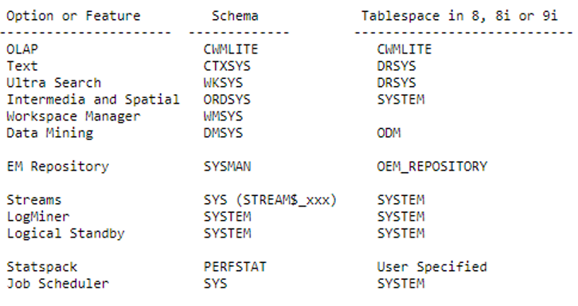
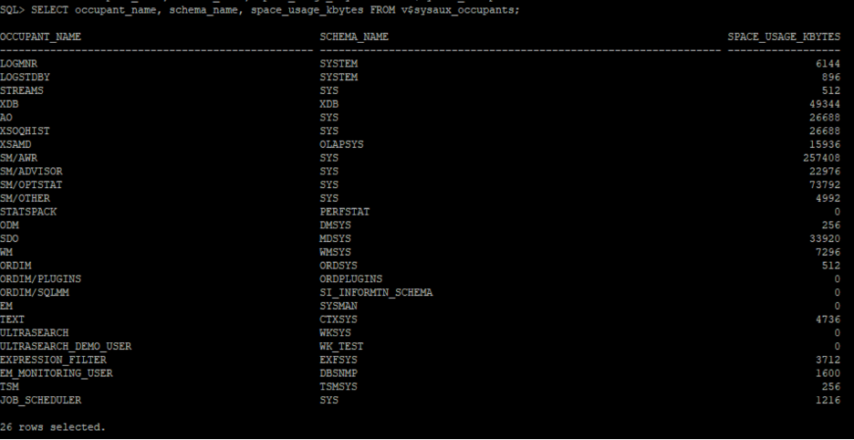
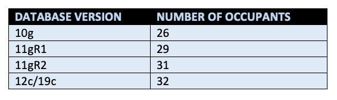
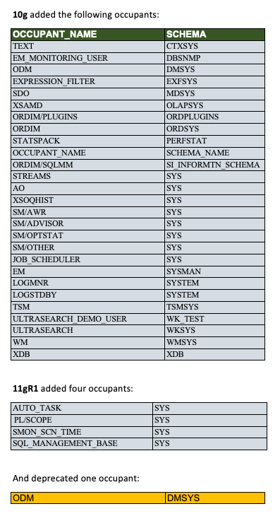
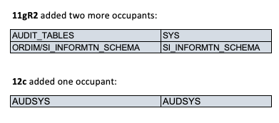
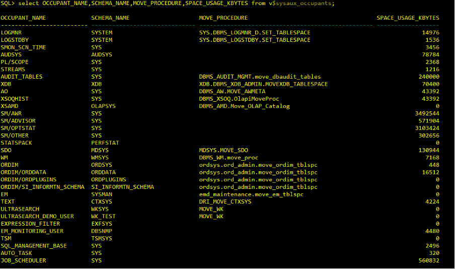
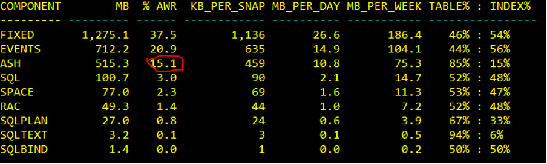
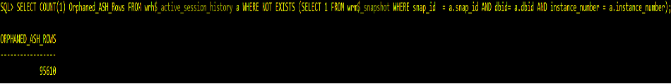

Oracle&reg; 10g introduced a new mandatory tablespace called SYSAUX with
mandatory attributes like **PERMANENT**, **READ WRITE**,
**EXTENT MANAGEMENT LOCAL**, and **SEGMENT SPACE MANAGEMENT AUTO**. This post
explores how to manage this tablespace as it grows.

<!--more-->

### Introduction

You can use the SYSAUX tablespace to perform the following tasks:

- Avoid SYSTEM tablespace fragmentation caused by install and deinstall options.
- Avoid risking  SYSTEM tablespace corruption and out-of-space situations.
- Reduce maintenance for the database administrator.
- Store and reduce tablespaces for all auxiliary database metadata related to
  Oracle options and features, such as the following items:

{{}}

 

### SYSAUX occupants

There are 26 SYSAUX occupants that you can query, as shown in the following
example:

    SQL> select OCCUPANT_NAME,OCCUPANT_DESC
         from V$SYSAUX_OCCUPANTS
         order by SPACE_USAGE_KBYTES desc

{{}}

 

Later versions of Oracle Database added even more versions, as shown in the
following image:

{{}}

 

The following image shows the components added or deprecated in each Oracle
Database version:

{{}}

{{}}

 

### Proactive SYSAUX tablespace management

To proactively monitor and manage SYSAUX tablespace proactively, perform the
following actions:

1. Set the SYSAUX tablespace to **AUTOEXTEND off**.
2. Confirm the **STATISTICS_LEVEL** value.

       - The **ALL** value is sometimes resource-intensive.
       - The **Basic** and **Typical** values tend to consume fewer resources.

3. Check how you use advisors, baselines, and SQL tuning sets. Advisors need to
   retain information in snapshots even if you plan to drop the snapshot range.
4. Run a query to determine which sysaux_occupant consumes the most space in the
   SYSAUX tablespace.

### Remedial SYSAUX tablespace management

The SYSAUX tablespace grows for the following reasons:

- You set an excessive retention period.
- the segment advisor grows too large.
- The active session history (ASH) grows too large.

The following sections offer some remedial actions:

#### Check the AWR retention period

To manage this, check the retention period of the Automatic Workload Repository
(AWR) snapshot. The AWR collects the performance statistics for problem detection
and performance tuning and stores the details in memory and database tables. The
system deletes stored data based on the retention period. If the retention period
is too high, this data consumes more space in the SYSAUX tablespace. So, you
should set an appropriate retention period. Check retention period by using the
following query:

    SQL> SELECT retention FROM dba_hist_wr_control;

You can alter the retention manually by using the
`DBMS_WORKLOAD_REPOSITORY.MODIFY_SNAPSHOT_SETTINGS` procedure.  The following
example sets the retention period to 5760 minutes (or four days:
4 days \* 24 hours per day \* 60 minutes per hour = 5760 minutes):

    SQL> execute DBMS_WORKLOAD_REPOSITORY.MODIFY_SNAPSHOT(RETENTION=>5760);

 

#### Check the largest object in the SYSAUX tablespace

Run the following query to identify the largest occupant in the tablespace:

    SQL> select OCCUPANT_NAME, SCHEMA_NAME, MOVE_PROCEDURE, SPACE_USAGE_KBYTES
         from v$sysaux_occupants;

{{}}

 

You use the **move** procedure command to move the occupant to another tablespace
unless the **move** procedure is null.

The following example moves WKSYS occupant in XYZ tablespace:

    SQL> execute WKSYS.MOVE_WK(‘XYZ’);

 

#### Check the Active Session History (ASH)

See if the ASH consumes more space in AWR data by using the following script:

    SQL> @$ORACLE_HOME/rdbms/admin/awrinfo.sql

{{}}

 

ASH usage is acceptable at 1.1 percent. If it is high, delete orphaned ASH rows.
Check for orphaned rows by using the following query:

    SQL> SELECT COUNT(1) Orphaned_ASH_Rows FROM wrh$_active_session_history a
         WHERE NOT EXISTS (SELECT 1 FROM wrm$_snapshot WHERE snap_id  = a.snap_id
         AND dbid= a.dbid AND instance_number = a.instance_number);

{{}}

 

Because the value is larger than zero, delete. We the orphans by using the
following query:

    SQL> DELETE FROM wrh$_active_session_history a WHERE NOT EXISTS
         (SELECT 1 FROM wrm$_snapshot WHERE snap_id = a.snap_id
         AND dbid = a.dbid AND instance_number = a.instance_number);

Then, run the following query to shrink the **WRH$_ACTIVE_SESSION_HISTORY**
table to reclaim the freed space:

     SQL> alter table WRH$_ACTIVE_SESSION_HISTORY shrink space;

### Conclusion

This post introduces the SYSAUX tablespace. It also provides suggestions on
monitoring and managing space growth in the SYSAUX tablespace default occupants
and identifying any non-default objects wrongly stored in the tablespace.

<a class="cta red" id="cta" href="https://www.rackspace.com/data/databases">Learn more about our Database services.</a>

Use the Feedback tab to make any comments or ask questions. You can also click
**Let's Talk** to [start the conversation](https://www.rackspace.com/).
