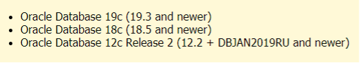
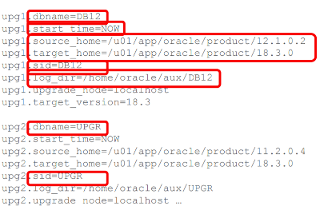
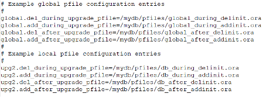
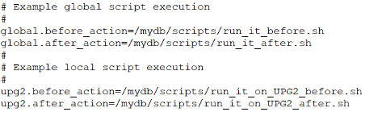

The Oracle&reg; Database version 19c introduced a slew of new and improved
features.

<!--more-->

### Introduction

Oracle 19c is the last in the Oracle Database 12c release 2 product family with
long-term support. It is available on Linux&reg;, Windows&reg;, Solaris&reg;,
HP/UX&reg;, and AIX&reg; platforms as well as the Oracle Cloud. Oracle 19c
provides customers with the best performance, scalability, reliability, and
security features for all their operational and analytical workloads.

### Features

Following are the new features that make database administrator (DBA) tasks easier:

- DBCA silent mode improvements. Use DBCA in silent mode to perform the
  following tasks:
  - Clone a remote PDB.
  - Relocate a PDB to another container database (CDB).
  - Create a duplicate of an Oracle Database.
- Dry-run validation of an Oracle Clusterware upgrade.
- Flashback in Data Guard.
- DML mode in Data Guard.
- Network file retention and size limits.
- Automatic indexing feature.
- Image-based Oracle client installation.
- AutoUpgrade for an Oracle database.

The following sections explore these features in more depth.

#### DBCA silent mode

Use DBCA silent mode for cloning or relocating a PDB, CDB, or non-CDB database,
as shown in the following examples:

- To create a PDB by cloning a remote PDB with DBCA in silent mode, use the
  following syntax:

       dbca -createPluggableDatabase -createFromRemotePDB -remotePDBName <REMOTE_PDB_NAME> -remoteDBConnString <REMOTE_DB_CONN_STRING> -sysDBAUserName <SYSDBUSERNAME> -sysDBAPassword <SYSDBAPASSOWRD> -dbLinkUsername <DBLINK_COMMON_USER_NAME> -dbLinkUserPassword <DBLINK_COMMON_USERNAME_PWD> -sourceDB <Local_CDB> -pdbName <PDBTOBECREATED>

- To relocate a PDB to another CDB, use the following syntax:

       dbca -silent -relocatePDB -remotePDBName <REMOTE_PDB_NAME> -remoteDBConnString <REMOTE_DB_CONN_STRING> -sysDBAUserName <SYSDBUSERNAME> -sysDBAPassword <SYSDBAPASSOWRD> -dbLinkUsername <DBLINK_COMMON_USERNAME> -dbLinkUserPassword <DBLINK_COMMON_USERNAME_PWD> -sourceDB <DBNAME_PDB_TOBERELOCATED> -pdbName <PDBTOBERECREATED

- To create a duplicate of a non-CDB or Real Application Clusters (RAC) database,
  use the following syntax:

       dbca -silent -createDuplicateDB -gdbName test -primaryDBConnectionString <Hostname>:1521/orcl.us.rackspace.com -sid test -databaseConfigType SINGLE -initParams db_unique_name=test -sysPassword XXXXX

#### Dry-run validation in Grid upgrades

This feature makes automation and prechecks tasks as real as possible by
providing similar inputs and outputs that a DBA would use for upgrade tasks.
This feature is for RAC only and not yet available for Oracle Restart. Following
are the checks performed in a dry-run Grid upgrade:

- Precheck inputs and outcomes
- Does not run any configuration tools
- Checks system readiness for an upgrade
- Storage and network configuration
- Software and hardware requirements
- Patch requirements and applies patching if required

Syntax:  `$ORACLE_HOME/runinstaller dryRunForUpgrade`

**Note:** After a dry run, you must detach **ORACLE_HOME** on the first node to
proceed with an actual upgrade. Use the following syntax to perform this task:

runInstaller -silent –waitforcompletion -detachHome ORACLE_HOME=<> -local

#### Flashback in Data Guard

The primary database and standby are now available in the same current state.
The standby is in sync with primary even if you flashback the primary database
by using the flashback feature.  In previous releases of the Oracle up to version
19c, you had to perform a manual process to keep the standby in the same state
and synced with the primary.

#### Oracle Active Data Guard with DML and PL/SQL

You can now use DML and PL/SQL in standby mode. As an Oracle Active Data Guard
user, you can run DML statements or PL/SQL codes at the database level. Also,
you can run DML statements or PL/SQL codes at the session level as needed if you
haven't configured settings at the database level. Use the following settings
and commands:

- For all the sessions of DML activity, set the parameter at standby:

       ADG_REDIRECT_DML=TRUE 

- For all the sessions of PL/SQL Activity, set the parameter at standby:

       ADL_REDIRECT_PLSQL=TRUE

- For the current session settings, use:

       ALTER SESSION ENABLE ADG_REDIRECT_DML ;
       ALTER SESSION ENABLE ADL_REDIRECT_PLSQL ;

#### Network trace and log file automatic purging

Oracle introduced Automatic Diagnostic Repository (ADR) and non-ADR listener
parameters to control log and trace file retention. Following are the parameters
that take care of limitations. By default, the system does not set these. If set
to 0, they work without limitation. You can set the following non-zero limits:

- **LOG\_FILE\_NUM\_listener\_name**: Specifies number of log file segments
  (Default: Not set).
- **LOG\_FILE\_SIZE\_listener\_name**: Specifies the maximum listener log file
  size in MB (Default: 300MB).
- **TRACE\_FILEAGE\_listener\_name**: Specifies the maximum age of listener trace
  file in minutes. (Default: Unlimited).
- **TRACE\_FILELEN\_listener**: Specifies size the maximum listener trace file
  size in KB (Default: Unlimited).

#### Automatic index feature

The newly introduced package lets you use SQL Access Advisor for automatic task
configuration of index creation, rebuild, and analysis. The following packages
work with it:

- dbms\_auto\_index.configure
- dbms\_auto\_index.report\_activity

Use the **DBA_INDEXES** column, **AUTO**, to ensure that auto index configuration
created an index.

#### Imaged-based Oracle client installation

Admin clients can now do image-based Oracle client installation the same as
Oracle Database software binaries.

#### AutoUpgrade Introduction

You can upgrade Oracle Databases automatically by using the AutoUpgrade feature.
The configuration file is the base of this feature. By using it, you can guide
the AutoUpgrade process, controlling the many Oracle Database upgrade options.

**AutoUpgrade utility**: **oracle_home/rdbms/admin/autoupgrade.jar**

**Location of log/configuration files**:

- Unix and Linux&reg; systems: **/tmp/autoupgrade**
- Microsoft&reg; Windows&reg;: **C:\Users\name\AppData\Local\Temp\autoupgrade**
- Default configuration file name: **autoupgrade <YYYYMMMMMHHMMSS>.cfg**, where
  **YYYY** is year, **MMMM** is month, **HH** is hour, **MM** is minute, and
  **SS** is second

##### AutoUpgrade prerequisites

- JDK 8 (Also available in binary since 12.1 release)
- The same rules apply for the manual upgrade as for the upgrade compatibility.
- To upgrade into a target CDB, the target CDB must already exist.
- You can directly upgrade versions 11.2.0.4 and later and convert a non-CDB to
  CDB.
- Make sure the target OracleHome is available and patched with the latest RU/RUR
  before running AutoUpgrade.
- Archivelog mode ON
- Download and use the AutoUpgrade utility to automatically upgrade the following
  versions:

{{}}

##### What to upgrade or not with AutoUpgrade

The following list shows what to upgrade or avoid upgrading with AutoUpgrade:

- Upgrade one or many Oracle databases.
- Non-CDB and CDB, including Non-CDB to CDB direct conversion with an upgrade.
- Can support SE2 and Enterprise Edition DB.
- Works with all operating systems.
- Upgrade RAC databases.
- Not compatible with Grid infrastructure upgrades.

#### How to set up, upgrade, monitor, and use AutoUpgrade

Perform the following steps to use AutoUpgrade:

##### Set up

1. Oracle recommends checking the current version and downloading the latest
   from MOS 2485457.1 for the upgrade.
2. Set up the configuration file parameters on the command line by using the
   following syntax:

        java –jar autoupgrade.jar –config /dir/myconfig.cfg –config_values “source_home=/srcdir, target_home=/trgdir, sid=sales” –mode deploy

Alternately, you can use the following environment variables and config
parameters declared empty:

- `ORACLE_HOME = /u01/app/oracle/product/12.1.0.2`
- `ORACLE_TARGET_HOME = /u01/app/oracle/product/19.0.3`
- `ORACLE_SID= mydb`
- `ORACLE_TARGET_VERSION = 18.3`

The preceding commands generate a configuration file with a default name, which
you can modify for your environment and then proceed with the following steps:

{{}}
  
You can also define Global variables and local variables. Local variable
declaration overrides global variables as shown in the following image:

{{}}

You can also automatically run batch processing commands by using shell scripts
or a PowerShell&reg; script or batch file, as shown in the following image:

{{}}
  
##### Upgrade the same source and target

To upgrade the same server source and target Oracle Database, use the following
sequence as recommended by Oracle:

1. `java –jar autoupgrade.jar -config_values "" -mode analyze`
2. `java –jar autoupgrade.jar -config_values "" -mode fix`
3. `java –jar autoupgrade.jar -config_values "" -mode deploy`

##### Upgrade a different source and target

For different source and target Oracle product upgrades, use the `analyze` and
`fix` commands from the previous step on the source and use the following
`upgrade` command on the target:

`java –jar autoupgrade.jar -config_values "" -mode upgrade`

##### Monitor the upgrade

You can monitoring AutoUpgrade by using the console, the HTML file in log
location, and log files for validation and monitoring from the following
locations:

- /cfgtoollogs
  - ./upgrade/auto/status <- Status logs
- /database_1
  - ./job_number
  - ./prechecks  
  - ./preupgrade  <- Preupgrade logs
  - ./prefixups
  - ./drain
  - ./dbupgrade   <- Upgrade logs
  - ./postupgrade
  - ./temp
- /database_2

##### Using AutoUpgrade

**Important**: Here are some tips for the usage of commands in the AutoUpgrade
console:

- Never use **Control + C**, **Control + V**, **Control + D**, or **exit** at
  the  prompt because it stops the upgrade.
- Advanced users should use the `-noconsole` option.

Use the following AutoUpgrade job status commands to start and stop jobs:

- **List jobs**: `lsj`
- **Restart a job**: `resume -job <number>`
- **Show job status**: `status [-job <number>]`
- **Restore database from GRP**: `restore -job <number>`
- **Abort the specified job, which you can resume**: `abort -job <number>`

### Conclusion

By using the new features in this post, a DBA can easily manage database
software installations, upgrades, and performance tune SQL queries with degraded
performance caused by a lack of indexes or poor index performance. Don't forget
to check the usage of the Oracle 19c new features on your test environment before
putting into an action plan on the production environment.

<a class="cta teal" id="cta" href="https://www.rackspace.com/data/database">Learn more about our Database services.</a>

Use the Feedback tab to make any comments or ask questions. You can also
[start a conversation with us](https://www.rackspace.com/contact).
