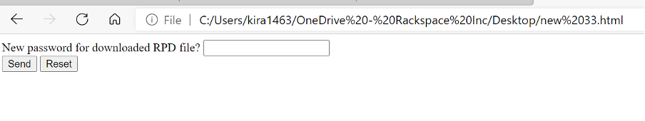
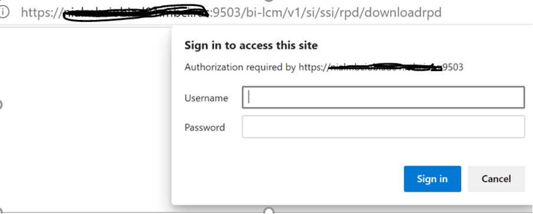
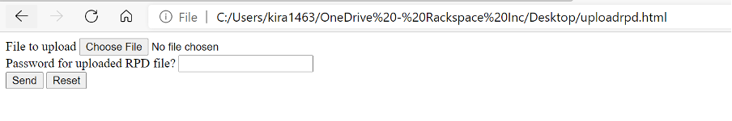
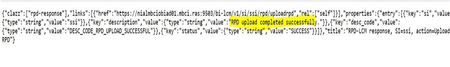

The blog discusses how to download and upload the Repository Database (RPD) for
Oracle&reg; Business Intelligence Enterprise Edition (OBIEE) 12C by using HTML
code in your web browser.

<!--more-->

### Overview

You usually deploy an RPD by logging in to an OBIEE application server and running the `datamodel` command. You need to place the RPD on the OBIEE app server and run `datamodel` to download or upload the RPD. However, you can instead directly upload and download the RPD from your local machine by following the method described in this post.

### Download an RPD

To download an RPD, perform the following steps:

1. Save the following code as an **.html** file and open it in a browser.

       <html>  
          <body>
             <FORM action="https://hostname:9503/bi-lcm/v1/si/ssi/rpd/downloadrpd"
                method="post" target=_blank>
                

                  New password for downloaded RPD file? <INPUT type="password" name="target-password"> 
                   <INPUT type="submit" value="Send"> <INPUT type="reset">
             </FORM>
          </body>
       </html>

   You should see a response similar to the following image:

   {{}}

2. Enter the rpd password, and it prompts you for the OBIEE admin username and
   password, as shown in the following image:

   {{}}

3. Enter the Weblogic username and password to download the live RPD.

### Upload an RPD

To upload an RPD, perform the following steps:

1. Save the following code as an **.html** file and open it in a browser.

       <html>  
          <body>
             <FORM action="https://hostname:9503/bi-lcm/v1/si/ssi/rpd/uploadrpd"
                method="post" enctype="multipart/form-data" target=_blank>
                  File to upload <INPUT type=file name="file"> 
                  Password for uploaded RPD file? <INPUT type="password" name="rpd-password"> 
                  <INPUT type="submit" value="Send"> <INPUT type="reset">
             </FORM>
          </body>
       </html>

   You should see a response similar to the following image:

   {{}}

2. Select the required RPD file and enter the RPD password to send the request.
   The RPD upload successful message should display, as highlighted in yellow in
   the following snapshot:

   {{}}

**Note:** Remember to change the hostname and port for your application server.

### Conclusion

The method shown in this post is a more straightforward way of downloading or
uploading an RPD without logging in to the app server. This script is easy to
run and expedites the entire process. This code works for OBIEE 12C and Oracle
Analytics Server (OAS) as well. It is a significant improvement over the
`datamodel` script method of deploying RPD files.

<a class="cta blue" id="cta" href="https://www.rackspace.com/data/databases">Learn more about our Database services.</a>

Use the Feedback tab to make any comments or ask questions. You can also
[start a conversation with us](https://www.rackspace.com/contact).
