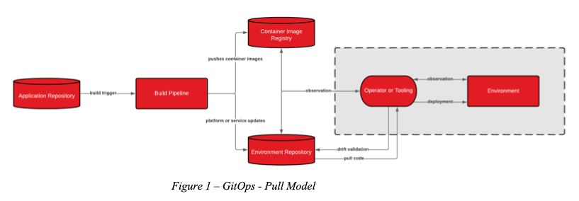
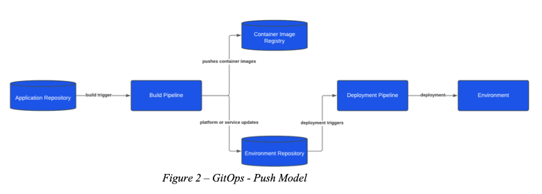

As your organization adopts Cloud Native architectures, a shift in mindset must
take place.

<!--more-->

This shift includes understanding new service models and frameworks and defining
new processes to move towards Cloud Native sustainably. Through transformation
efforts, you need to define and adopt effective processes and frameworks that
enable engineering teams to deliver standardized services and ensure reliability
and security.

### Continuously deliver services while establishing effective guardrails

The GitOps processes and practices introduce tools, processes, and guardrails to
enable you to deploy, secure, monitor, and standardize Cloud Native applications
effectively. GitOps is not limited to Kubernetes, so you can use GitOps processes
and practices to deploy infrastructure and services that you can observe and
describe declaratively.

Enable GitOps by using declarative configuration languages to define services
and platforms. Then, use a source control repository to manage and deploy code
through continuous deployment. GitOps also leverages Kubernetes Operators or
infrastructure tools to manage the state for the defined configuration to
ensure drift does not occur.

### GitOps principles

The following sections describe four key principles for GitOps:

#### 1. Declare the service or platform through code

Tools, such as Kustomize&reg;, Helm&reg;, Terraform&reg;, and Ansible&reg;,
declare services and platforms through configuration languages. You store the
repository for the templates and manifests in a git-based source control system
to enable a single source of truth for DevOps or SRE teams.

#### 2. Set guardrails to protect systems

You can set effective guardrails to decrease blast radius and protect systems by
declaring all services and platforms and using source control.

Enforce effective role-based access control and enable effective audit logging
to meet security requirements. Integrate the service or platform repository into
CI/CD tools to enable deployments with approval through pull, push, or merge
requests and ensure faster recovery times when you need to do a rollback.

#### 3. Detect and manage drift across services and platforms

By integrating infrastructure tools or Kubernetes Operators into the GitOps
process, you ensure that the services and platforms defined through code stay
aligned with the repository. You achieve this by enabling Kubernetes Operators
or infrastructure tools to monitor the current state of services or platforms
and ensure that the system reconciles the desired state when drift occurs.

#### 4. Automate services and platform deployments with continuous integration

The repository for the services or platform hosting the application can either
follow a push or pull model for deployments. The pull model integrates with
Kubernetes Operator or infrastructure tools to identify application, service, or
platform repository changes. After detecting changes, the Kubernetes Operator or
infrastructure tools then deploy changes to the environment. By using the push
model, engineers push code to the environment repository that hosts the code for
either the service or platform. This then triggers a build or change in the
environment by using the Kubernetes Operator or infrastructure tools.

{{}}

 

{{}}

 

### GitOps benefits

GitOps can enable an effective foundation for building Cloud Native applications.
The key principles of GitOps highlight the following benefits for organizations:

#### Faster time to market through continuous deployment

You can increase the acceleration of new features and products to market by using
GitOps practices, processes, and tools. This enables engineering teams to automate
deployments, enabling faster release rates to help gain quick customer feedback
and improve customer satisfaction.

#### Improved reliability of platforms and services

As you define the services or platforms declaratively through code, you can
integrate code testing into the CI/CD pipelines. Through this integration, you
can enable approval, testing, and rollback processes for changes. This
helps improve the overall reliability and mean time to recovery or mean time to
restore (MTTR) of applications when deploying new changes to the environment.

#### Standardized and consistent deployments

The end-to-end process for deploying or changing services or platforms becomes
standardized and consistent when you use GitOps processes, practices, and tooling.
As they manage service and platform configuration through code, engineers can
understand the current and past states by viewing the repository branch logs.

#### Security becomes a first-class citizen for deployments

As you track new and current deployment changes through the git log, you can see
an audit trail of who did what to your infrastructure and when it happened. You
can use that information to meet SOC 2 compliance and ensure stability. Enforcing
encryption and approval processes and defining RBAC roles for repositories can
decrease the attack surface for services and platforms.

### Summary

This post illustrates how you can integrate the GitOps processes, practices, and
tools with a wide range of benefits. GitOps helps to define a strong foundation
for an organization’s journey to Cloud Native. It also ensures that you can move
towards Cloud Native architectures in a controlled fashion and deliver new
features faster while maintaining application reliability.

<a class="cta red" id="cta" href="https://www.rackspace.com/hub/modern-cloud-applications">Let our experts guide you on your cloud-native journey.</a>

Use the Feedback tab to make any comments or ask questions. You can also
[start a conversation with us](https://www.rackspace.com/contact).
