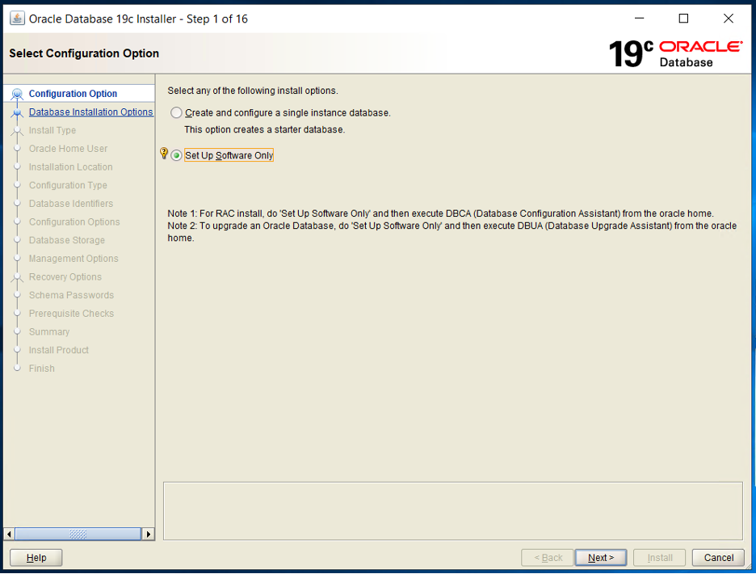

Oracle&reg; 19c Database is the latest release of a widely adopted automation
database in the market and enterprises. Stability is an important element of the
Oracle Database 19c component of the Oracle Database 12c (Release 12.2) family of
products. In this two-part blog post series, I cover installing in part 1 and
upgrading in part 2.

<!--more-->

### Overview

{{}}

In part 1, I focus on installing Oracle 19c on a Windows&reg; environment.
You might wonder if you can install Oracle DB 19c on the x32 bit Windows
operating system, but the answer is no. Oracle 19c is compatible with only
x64bit Windows.

### Installation steps

Perform the following steps to install Oracle 19c on Windows:

##### Execute the installation file

To prepare for the installation, perform the following steps:

1. Download the software **WINDOWS.X64_193000_db_home.zip** from the following link:
[https://www.oracle.com/in/database/technologies/oracle19c-windows-downloads.html](https://www.oracle.com/in/database/technologies/oracle19c-windows-downloads.html )

2. Extract the zip file  **D:\app\product\WINDOWS.X64_193000_db_home.zip** and
set the extraction folder to **D:\app\product\19.0.0\dbhome_1**, which is the
Oracle 19C Home directory.

3. After the zip extraction completes, execute
**D:\app\product\19.0.0\dbhome_1\setup.exe** and perform the following
installation steps.

##### Step 1

Select the `Set Up Software Only` radio button because you want to install the
software without creating an Oracle database. In my case, I already have an Oracle
database version 11g.

<image1>

##### Step 2

Select the `Single instance database installation` radio button because you're
not installing an Oracle Real Application Cluster (RAC) database, which can have
multiple instances.

<image2>

##### Step 3

Oracle Database 19c is available in the following editions:

- (EE) Oracle Database 19c Enterprise Edition
- (SE2) Oracle Database 19c Standard Edition 2

Select the radio button for `Enterprise Edition` to install the Enterprise edition.
If you want to install the standard edition, then select `Standard Edition 2`.
The Enterprise edition has additional costs compared to the Standard edition,
and the choice is up to you.

<image3>

##### Step 4

Select the `Use Virtual Account` radio button. The Oracle home user can be a
Windows built-in account, virtual account, or a regular (non-administrator)
Windows account. If you specify an existing user as the Oracle home user, the
Windows user account you specify can either be a Windows domain user or a Windows
local user.

As an administrator, do not create a Windows user account if you use a virtual
account or a Windows built-in account during the installation. For example, if
you specify a non-existing user for the Oracle home user, the Windows user
account you specify needs to be a Windows local user. The Oracle installer
creates this account automatically to run the Windows Oracle services for the
Oracle home.

<image4>

##### Step 5

Specify the location of the Oracle base. In this case, I selected **D:\app**.
Again, you can change this directory at your convenience or opt for the default
one.

<image5>

##### Step 6

The installer verifies all the prerequisites. If there are any errors, try to
readjust the [minimum installation requirements](https://alekciss.com/oracle-database-19c-installation/)
as follows and restart.

You can install Oracle Database 19c on the following Windows x64 distributions:

- **Windows Server 2019 x64**: Standard, Datacenter and Essentials
- **Windows Server 2016 x64**: Standard, Datacenter and Essentials and Foundation
- **Windows Server 2012 R2 x64**: Standard, Datacenter and Essentials
- **Windows 10 x64 Pro**: Enterprise and Education
- **Windows 8.1 x**: Enterprise

**Note**: You must update your operating system before starting the Oracle
Database installation to avoid any issues with Oracle 19c.

Click install if no error occurs.

<image6>

##### Step 7

The installer shows you the summary, including the Oracle base, Oracle software
location, Oracle database edition, and Oracle home user.

<image7>

##### Step 8

The installer starts the Oracle 19c installation. If you get any errors during
the installation, you need to fix them to complete the installation successfully.

<image8>

##### Step 9

The installer shows you the final successful page with the following output if
no errors occurred during the installation.

<image9>

### Conclusion

With the help of this blog post, you can easily understand and follow the
Oracle 19c installation steps in the Windows environment.

Stay tuned for the second part of this series, where I discuss upgrading your
database.

<a class="cta teal" id="cta" href="https://www.rackspace.com/data/databases">Learn more about our Database services.</a>

Use the Feedback tab to make any comments or ask questions. You can also
[start a conversation with us](https://www.rackspace.com/contact).
