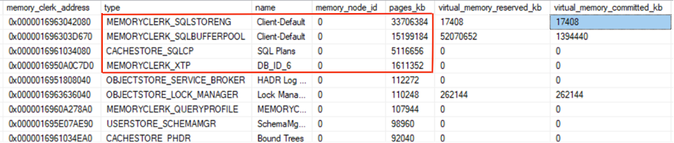
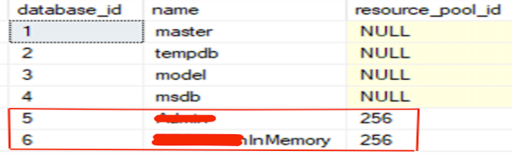

The Microsoft SQL Server is very smart in terms of memory management, but
sometimes memory pressure alerts and database engines demand more memory,
leading to errors.

<!--more-->

### Introduction

This post discusses how to resolve one of the exceptional scenarios you might
experience because of memory pressure on SQL Server&reg; 2019 (Enterprise Edition)
caused by the memory-optimized tables (In-memory Online transaction processing
(OLTP)). The same steps apply to SQL Server 2014 and later.

You might see the following error messages flash on your screen:

    Message: MSSQL on Windows: Stolen Server Memory is too high
    Source: XXXXX\MSSQLSERVER Path: Not Present Alert
    description: SQL instance "MSSQLSERVER" Stolen Server Memory on
    computer "XXXXXXX.XXX.com" is too high.

    Message: SQL Server Alert System: 'Severity 17' occurred on \\XXXXXXX
    DESCRIPTION:   There is insufficient system memory in resource pool 'internal'
    to run this query.

    Message: Disallowing page allocations for database 'InMemoryDB' due to
    insufficient memory in the resource pool 'default'. See
    'http://go.microsoft.com/fwlink/?LinkId=510837' for more information.

    Message: XTP failed page allocation due to memory pressure: FAIL_PAGE_ALLOCATION 32

### Solution

Perform the following steps to troubleshoot and resolve this issue:

##### Step one

The first step is to check the memory consumption in the SQL buffer pool.

{{}}

As you can see from the preceding image, the database in question, **InMemoryDB**,
consumes only 0.017% of the buffer pool.

##### Step two

Then you check the OS Memory Clerks using the following T-SQL command:

    select * from sys.dm_os_memory_clerks order by pages_kb desc

{{}}

The results show that the total of top consumers was around 80% of the total
maximum server memory.

The size of the memory-optimized tables is also less than 2 GB, which you can see
in the preceding image for the name, **DB_ID_6**. As such, ideally, there should
not be any memory pressure on the server.

##### Step three

After reviewing the Out of Memory (OOM) links mentioned in the error log,
**http://go.microsoft.com/fwlink/?LinkId=510837**, you need to bind the database
with memory-optimized tables to a resource pool. This binding is a best practice
for databases with memory-optimized tables. Follow the steps to create a resource
pool in the resource governor and bind the database.

Best practices recommend that you protect SQL Server from having its resources
consumed by one or more memory-optimized tables and prevent other memory users
from consuming memory needed by memory-optimized tables. Therefore, you should
create a separate resource pool to manage memory consumption for the database
with memory-optimized tables.

Keep the following points in mind when adding a database to the resource pool:

- You can bind a database on only one resource pool.
- You can bind multiple databases to the same pool.
- SQL Server enables binding a database without memory-optimized tables to a
  resource pool, but it has no effect.
- You can create memory-optimized tables in the database after binding it to a
  resource pool.

#### Steps to bind to a resource pool

1. Create Resource Pool with the Memory allocations:

       USE [master]
       GO

       CREATE RESOURCE POOL [Admin_Pool] WITH(min_cpu_percent=0, 
          max_cpu_percent=100, 
          min_memory_percent=15, 
          max_memory_percent=15, 
          cap_cpu_percent=100, 
          AFFINITY SCHEDULER = AUTO,
          min_iops_per_volume=0,
          max_iops_per_volume=0)
       GO

   **Note**: To avoid out-of-memory conditions, the values for
   **min_memory_percent** and **max_memory_percent** should be the same.

   In this case, the memory-optimized tables are very small, with 15% of the
   total server memory allocated to the resource pool. Don't forget to use the
   links in the references to calculate the percent of memory in your environment.

2. Verify the resource pool and bind the database to it:

       EXEC sp_xtp_bind_db_resource_pool 'InMemoryDB', 'Admin_Pool'  
       GO

3. Verify the bind in **sys.databases**:

       SELECT d.database_id, d.name, d.resource_pool_id  
       FROM sys.databases d
       GO

   {{}}

4. Restart the database to make the binding active:

       ALTER DATABASE DB_Name SET OFFLINE  
       GO  
       ALTER DATABASE DB_Name SET ONLINE  
       GO  

**Note**: If the database is always on, perform the steps on both the nodes, and
instead of Step 4 (restart databases), perform a database failover to the
secondary instance.

### Conclusion

In this case, all alerts related to memory pressure stopped after adding the
databases with memory-optimized tables to the resource pool. I monitored the SQL
Server error logs for a couple of weeks for this particular issue, and there were
no traces of any memory pressure. These steps helped fix the memory pressure on
the database engine level with minimal downtime.

<a class="cta purple" id="cta" href="https://www.rackspace.com/data/databases">Learn more about our Database services.</a>

Use the Feedback tab to make any comments or ask questions. You can also
[start a conversation with us](https://www.rackspace.com/contact).
