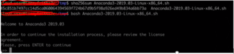
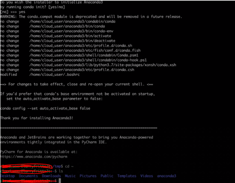
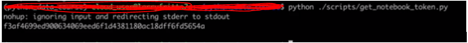
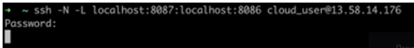
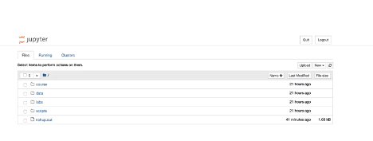

The blog introduces using Python&reg; for data management and reporting. Python
uses Jupyter&reg; Notebook to access data sources to explore reading and writing
data for generating reports from the source data.

<!--more-->

### Jupyter Notebook

In this post, I use the classic Jupyter Notebook running inside a browser from a
server that can be local or remote. Jupyter Notebook supports over 40 programming
languages, including Python, Java&reg;, and JavaScript&reg;.

Jupyter Notebook consists of the following components:

- Jupyter Server
- Notebook
- Kernel
- Reports and portfolios

### Install Jupyter Notebook, open a Notebook, and set the Kernel

**Note**: I used Ubuntu&reg; 18 on my server for this installation.

Perform the following steps:

1. Install all security patches on the server using the following command:

        sudo apt upgrade -y

2. Run the following command to install one or more packages for converting notebooks to PDF:

        sudo apt install -y texlive-xetex

3. To use Jupyter notebook, install Anaconda, a data science and machine learning
   platform based on Python. Download the **Anaconda3-2019.03-Linux-x86_64.sh** package.

4. Run the following command to ensure this download package is not corrupt:

        sha256sum Anaconda3-2019.03-Linux-x86_64.sh

5. Run the following command to install Anaconda:

        bash Anaconda3-2019.03-Linux-x86_64.sh

{{}}

{{}}

6. After the installation completes, restart the bash shell to include the changes
   by running the following command:

        source ~/.bashrc

7. Update the conda&reg; base code by running the following commands:

        conda config --set auto_activate_base false
        conda update -n base -c defaults conda

8. Create the conda virtual environment (such as **python\_data**) using the latest Python version by running the following command:

        conda create -n python_data python=3

9. Activate this virtual environment y running the following command:

        conda activate python_data

10. Run the following commands to make a directory to hold this GitHub repo:

        mkdir python_data
        cd python_data

11. Run the following commands to install the packages:

        conda activate python_data
        conda install jupyter psutil

### Connect to the Jupyter Notebook server

Perform the following steps to connect to the Juniper Notebook server:

1. Activated the virtual environment using the following command:

        conda activate python_data

2. Run the following script to start the server:

         python get_notebook_token.py 

   This script uses the following command to start the Jupyter Notebook server
   and continues to run it outside of the terminal window:

        nohup jupyter notebook --no-browser --port=8086

   This provides the token and searches the nohup output if you run the preceding
   command in the background by using **get\_notebook\_token.py** as highlighted
   in the following snapshot:

{{}}

3. Go to the terminal window of your local machine and enter the following command:

        ssh -N -L localhost:8087:localhost:8086 username@<the public IP address of the server>

{{}}

4. Leave this terminal open while using the Jupyter Notebook server in this session.

5. In the browser, enter the following URL **http://localhost:8087** and provide
   the token as input.

{{}}

After logging,  you can create a Jupyter Notebook by using Python code and Markdown cells.

{{}}

### Examining the data in a DataFrame

Use Pandas DataFrames inside of Jupyter Notebook for examining the data in a
DataFrame. Run the following command to import the **pandas** package.

    import pandas as pd

There are different ways to examine data using Pandas DataFrame:

- **.head()**: Displays the first five rows in the DataFrame.
- **.tail()**: Displays the last five rows in the DataFrame.
- **vet\_records**: Displays all the records of the DataFrame.
- **.dtypes**: Shows statistical operations on columns where you can perform these operations.
- **.at**:  Allows the user to change the value of a specific cell.
- **f: .assign**: Used to add another column of data.
- **vet_records.type.count()**: Used for counting and grouping data.
- **loc**: Allows you to use column names to slice data.
- **iloc**: Requires the use of index numbers.  For example:
  `.iloc[row, column]. remember: python` indexes starting at 0.
- **.isin**: Used to gather data about a list of items.

### Writing a report

For writing a report, you need to use LaTex&reg;. LaTex, built into Jupyter
Notebook, helps you create technical and scientific documents and is good at
displaying mathematical formulas. You can write LaTex formulas in a Markdown cell.

For the Jupyter report, use a data set that allows you to consider some aspects
of socioeconomic factors that may impact it.

To create the report and make sure to run the following commands to install
supporting packages:

     import matplotlib.pyplot 
     import numpy 
     import pandas
     import random

### Conclusion

You can create and share documents that contain live codes, equations, and
visualizations that help in data cleaning, transformation, and statistical
modeling in data science.

<a class="cta purple" id="cta" href="https://www.rackspace.com/data/databases">Learn more about our Data services.</a>

Use the Feedback tab to make any comments or ask questions. You can also
[start a conversation with us](https://www.rackspace.com/contact).
