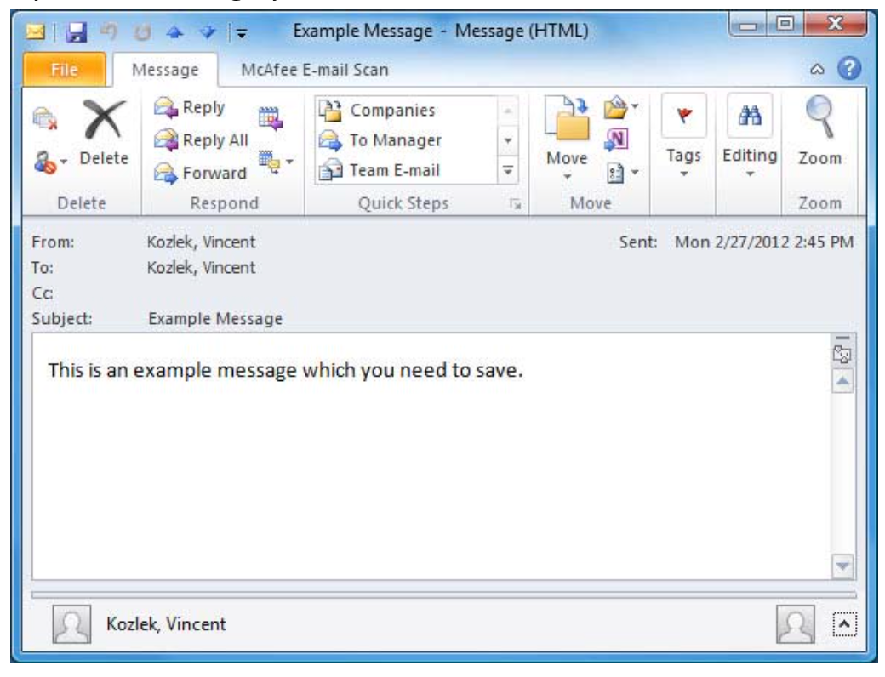

Replace with short intro sentence or two.

<!--more-->

### Overview

When you need to save important emails, we recommend that you save
them to your personal network storage (P drive).  You should create a folder on
your P drive that you will use to store the emails.  Please read the following
options you have when you need to save email(s), and then see below
for detailed instructions.  You must use Outlook (not Outlook Web App) to follow these instructions.

### Options

The following list blah blah:

1. You can save individual emails in the .msg format which will let you open the message in
Outlook and preserve all formatting and images, as well as keep the attachments.  This option
requires you to save each message individually.  If you have lots of messages to save at one
time, you may prefer another option.

2. You can save multiple emails at one time in the .txt format which will let you open the message
in Notepad by default and loses formatting, images, and attachments.  You would need to
remember to save attachments separately if you choose this option.  If you have a printer
installed named “Adobe PDF”, it is recommended you choose Option 3 instead of Option 2

3. You can save multiple emails at one time by selecting multiple messages and printing them to
the Adobe PDF printer which saves them in the .pdf format which will let you open the message
in Adobe Acrobat and preserve all formatting and in‐line images, but will not save the
attachments.  The messages will look as they would if you printed them to a color printer.  You
would need to remember to save attachments separately if you choose this option.

### Detailed instructions

Use the following steps to do this thing:

##### Save Individual emails in MSG format

1. Open the message you wish to save.

{{}}

2. Click **File->Save As**:

{{}}

##### Save multiple emails in TXT format

more content

### Conclusion

This post demonstrated.

<a class="cta red" id="cta" href="https://www.rackspace.com/data/databases">Learn more about our Database services.</a>

Use the Feedback tab to make any comments or ask questions. You can also
[start a conversation with us](https://www.rackspace.com/contact).
