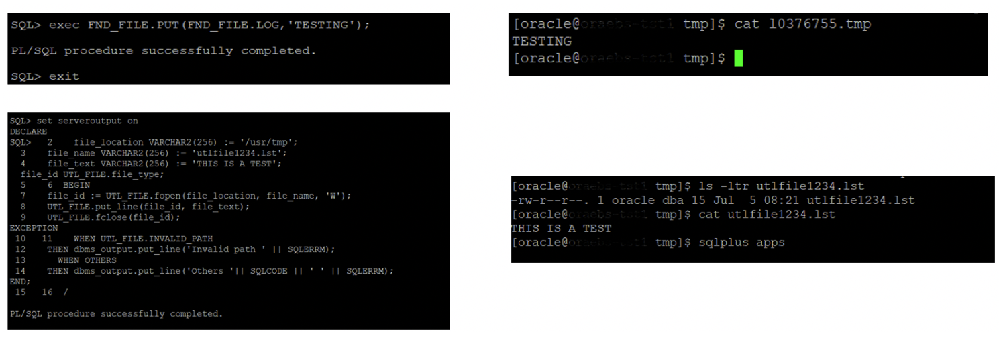

The Oracle E-Business suite uses OS level directories for *PL/Sql File I/O* for many different 
tasks such as generating temporary files, debugging files, log and output files etc. This 
*PL/Sql File I/O* is generally done using *utl_file* or *fnd_file* packages. However, starting 
with 18c version of the database, Oracle has de-supported the *utl_file_dir* parameter. 
Hence, to tackle this limitation in E-Business Suite product, Oracle introduced a supplemental 
*utl_file_dir* parameter. Oracle introduced new views *apps.v$parameter* and 
*apps.v$parameter2*, which provide and store this new supplemental *utl_file_dir* feature. 

In this blog, we will review how to use this new supplemental *utl_file_dir* feature in 
EBS R12 with a 19c database.

<!--more-->

Before database release 12c and earlier, initialization parameter *utl_file_parameter* was 
used to deal with PL/Sql related File I/O. To add a new path to have PL/Sql enabled File I/O, 
it was essential to add the OS path in the *utl_file_dir* parameter list and bounce the database. 
Only then developers could use that path in the EBS programs to perform File I/O using *utl_file* or *fnd_file* packages.
Once the OS directory path was added to the *utl_file_parameter*, one could use the packages 
such as *utl_file* and *fnd_file* for PL/Sql File I/O. 

The following given image shows some example outputs of how one could perform PL/Sql File I/O once *utl_file_dir* was enabled.

 
 {{}}
 

Now, starting with 19c database, to add/modify/delete an OS directory path for PL/Sql File I/O with EBS R12, you need to use script *txkCfgUtlfileDir.pl* provided under *$ORACLE_HOME/appsutil* path. This same script is also used to migrate these directory paths during upgrade also (from 12c or earlier versions) to 19c database. 
The following steps cover how to add/modify/delete a directory path to supplemental *utl_file_dir*. 
You need to enable the below event as a database initialization parameter at the CDB level to enable this feature.

          event='10946 trace name context forever, level 8454144'

1. To add/modify/delete a directory path in supplemental *utl_file_dir* parameter, you need to complete the following steps in a sequence: Get the list of directory path which currently exist in supplemental *utl_file_dir* parameter. You need to source the PDB environment and then run script *txkCfgUtlfileDir.pl* in *getUtlFileDir* mode. 
 
          $ . Run the following command $ORACLE_HOME/<pdb_name>_<hostname>.env
          $ perl $ORACLE_HOME/appsutil/bin/txkCfgUtlfileDir.pl -contextfile=$CONTEXT_FILE \
          -oraclehome=$ORACLE_HOME -outdir=$ORACLE_HOME/appsutil/log -mode=getUtlFileDir -servicetype=onpremise

 This script creates a text file named *<PDBNAME>_utlfiledir.txt* in the *<ORACLE_HOME>/dbs* directory which lists the existing directories defined in supplemental *utl_file_dir* list. This step reads the contents from *apps.v$parameter* and populates these to the file *$ORACLE_HOME/dbs/<PDBNAME>_utlfiledir.txt*.
 
2. Edit the text file *$ORACLE_HOME/dbs/<PDBNAME>_utlfiledir.txt* to add, modify or delete the OS directory path as per your requirement. Also verify that the new directory path is created/exists at OS level also and it should not have any soft links, as soft links in directory paths have also been deprecated in 19c version.
 
3. Now run the *txkCfgUtlfileDir.pl* script again in *setUtlFileDir* mode now to update the value of the supplemental *utl_file_dir*. 

          $ . $ORACLE_HOME/<pdb_name>_<hostname>.env

          $ perl $ORACLE_HOME/appsutil/bin/txkCfgUtlfileDir.pl -contextfile=$CONTEXT_FILE \
          -oraclehome=$ORACLE_HOME -outdir=$ORACLE_HOME/appsutil/log -mode=setUtlFileDir -servicetype=onpremise|opc

This step updates the *apps.v$parameter* view with the values available in file *$ORACLE_HOME/dbs/<PDBNAME>_utlfiledir.txt*.

4. Now you can sync these values with the DB tier context file using the following:

          $ . $ORACLE_HOME/<pdb_name>_<hostname>.env

          $ perl $ORACLE_HOME/appsutil/bin/txkCfgUtlfileDir.pl -contextfile=$CONTEXT_FILE \
          -oraclehome=$ORACLE_HOME -outdir=$ORACLE_HOME/appsutil/log -mode=syncUtlFileDir -servicetype=onpremise

You can verify the changes to supplemental *utl_file_dir* using a select query output from *apps.v$parameter* or *apps.v$parameter2* like below:

select value from *apps.v$parameter* where *name='utl_file_dir';*

The above steps also create a corresponding entry for directory objects in *dba_directories*. Once the above steps are completed, a new directory path added to the supplemental *utl_file_dir* will be available for use by E-Business programs. 

 
### Conclusion
 
One good advantage of this feature is that in database releases 12c and earlier versions, database bounce was needed whenever one needed to add/modify/delete a path in the *utl_file_dir* parameter. However, no downtime is needed while adding/deleting/modifying the path in supplemental *utl_file_dir* list in 19c. 

Also, please note that the two new views (i.e., *apps.v$parameter* and *apps.v$parameter2*) required for this new feature have been introduced in APPS schema. So the steps mentioned above are particular only for Oracle E-Business Suite Release 12 applications (i.e., 12.1.3 and 12.2).

 
### References 
 
Using UTL_FILE_DIR or Database Directories for PL/SQL File I/O in Oracle E-Business Suite Releases 12.1 and 12.2 (Doc ID 2525754.1)

<a class="cta teal" id="cta" href="https://www.rackspace.com/data/databases">Learn more about our Database services.</a>

Use the Feedback tab to make any comments or ask questions. You can also
[start a conversation with us](https://www.rackspace.com/contact).
