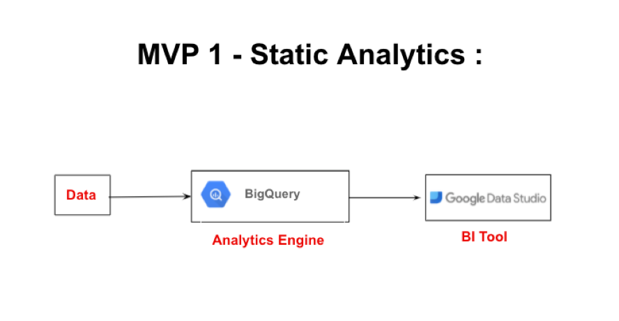
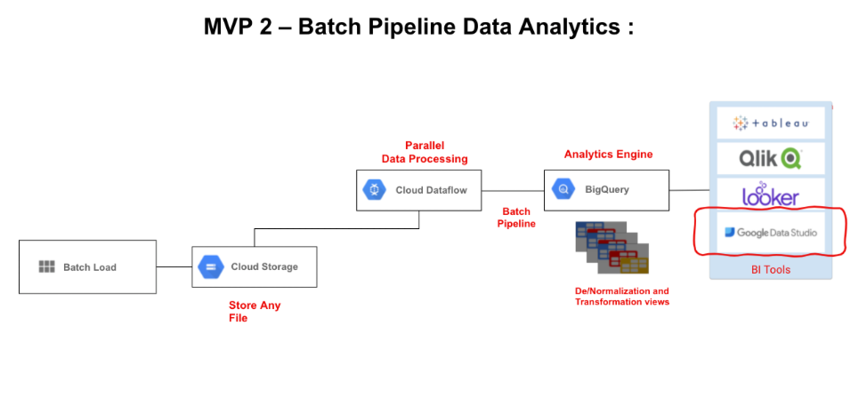
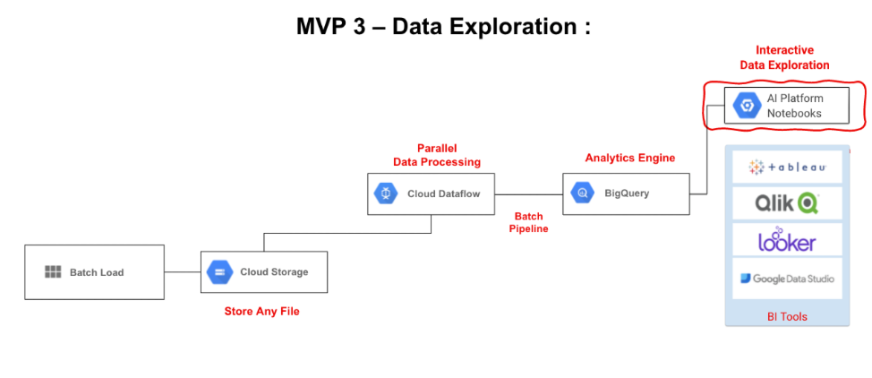
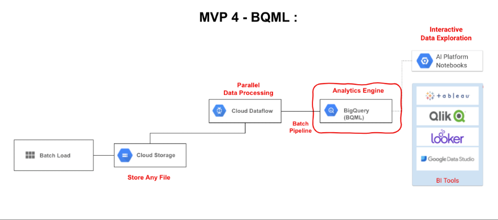
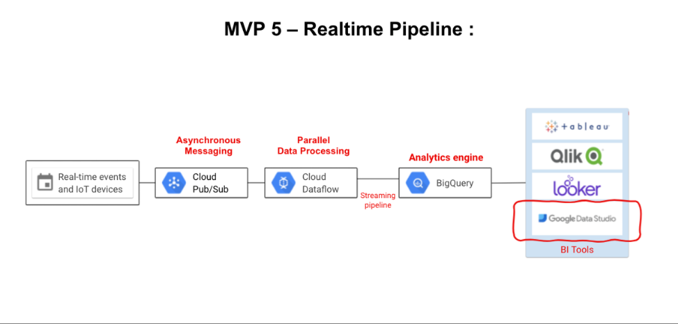
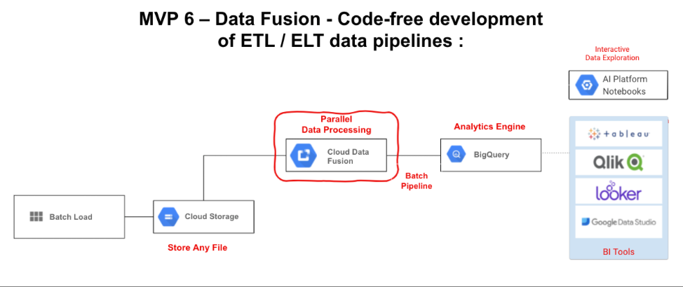
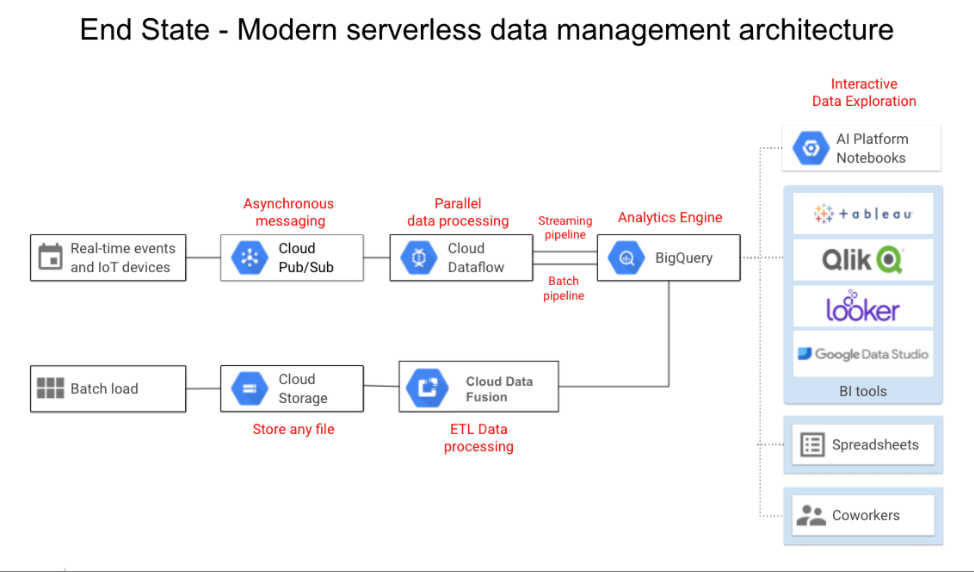

Customers today are in different stages of their Data modernization journey, and they 
need advice to fully realize the power of data based on their workflows. This article 
aims to offer a phased approach starting from simple data analytics to complex data 
workflows, machine learning models and Data Visualization insights using GCP’s Smart 
Analytics tools. The tool helps customers to accelerate their data adoption strategy 
and extract meaningful insights based on their data workflows to drive their business 
forward. 

<!--more-->

### Overview

The Google BigQuery is the power centre of Google Cloud Platform, and it can be chosen 
as the one stop service for all the customer challenges in the Data world. BigQuery is 
flexible, open, and intelligent. It replaces a Data Warehouse on prem and helps to 
create Data Marts by organizing the tables into different datasets as per the business 
requirement. Most importantly, BigQuery can be used as a Data Lake to load the raw data, 
and then transform the raw data according to the respective requirements. It can be an 
authorized distributor across your business. 

The following phases depicts how to kickstart the customers’ data journey.

### Phase 1: Static Analytics

Loading data (csv, json, Google Drive) manually into BigQuery, then query data from BigQuery followed by producing powerful visual dashboards via Google Data Studio. 

 {{}}
 

### Phase 2: Batch Pipeline Data Analytics

In the second phase, you need to automate and perform parallel data processing with the help of Cloud Dataflow using any types of files (csv, json) from Google Cloud Storage Bucket. Then, you need to upload the Data into analytics engine BigQuery. By using an ELT approach, de-normalize and perform transformations as per customer’s requirement by creating the specific views and tables. Followed by building the powerful dashboards using Google Data Studio as the visualization tool. You can have multiple visualization options like Tableau, Qlik on the GCP VM’s and the Google’s native Visualization tool Looker. 

 {{}}
 

### Phase 3: Deeper data exploration

In this phase, you can perform interactive Data Exploration, and quick visualization of the Data present in the BigQuery using AI Platform Notebook. You can start this phase by spinning an AI Platform Notebooks which allows the user to explore, analyze, transform, and visualize their data from Bigquery in much more depth fueled by the power of Python. The Jupyter Notebook seamlessly connects and interacts with the BigQuery in this phase.

 {{}}

 
### Phase 4: Simple ML Insights
This phase initiates the journey into ML by creating the respective models via BigQuery ML. This helps to predict the next values in the data. The process includes to write SQL like queries into BigQuery to create Machine Learning models, to train the data and predict the next values with respect to the data in the BigQuery. 

 {{}}

 

### Phase 5: Realtime Processing
Data pipelines captures Realtime or IoT data, ingested with the help of asynchronous messaging service by Cloud Pub/Sub. From this, you need to run parallel data processing using Dataflow, followed by feeding the data to BigQuery and generating dashboards using Google Data Studio. You can save the cost of the BigQuery streaming inserts by another option to use micro batch inserts from the Google Cloud Storage with the help of Google Data Flow. 

 
{{}}
 

### Phase 6: ETL Processing
The Data Fusion is a no code transformation tool, which helps to perform the ETL with the help of Graphical User Interface, same as the On-prem ETL Tools. Additionally, it does Data Wrangling for the Data Analyst to prepare the data before transformation.

 
{{}}
 

### Summary – Data Modernizing Journey
Kickstart the customer’s Data journey with the help of Google Cloud Native tools like-Google BigQuery, Google Data Studio, Dataflow, Cloud Pub/Sub, AI Platform, BigQuery ML and Data Fusion by adopting the above phased approach in a easy and a simple manner.
The following snapshot reflects the last stage of the Data Modernization Journey.
 
{{}}

All the above-described phases can be demonstrated with respect to the sample data and data pipelines. This makes it easier for customers to understand better on how to get started on their Data cloud journey.

Request a live demo: vijaykumar.jangamashetti@rackspace.com 

References: cloud.google.com/bigquery, cloud.google.com/storage, cloud.google.com/dataflow, cloud.google.com/pubsub, cloud.google.com/looker, cloud.google.com/solutions/smart-analytics  

<a class="cta purple" id="cta" href="https://www.rackspace.com/data/google-cloud-data">Learn more about our Google Cloud Data</a>

<a class="cta purple" id="cta" href="https://www.rackspace.com/lp/gcp-data-discovery-workshop">Book your Google Cloud Data Discovery Workshop</a>

Use the Feedback tab to make any comments or ask questions. You can also
[start a conversation with us](https://www.rackspace.com/contact).
