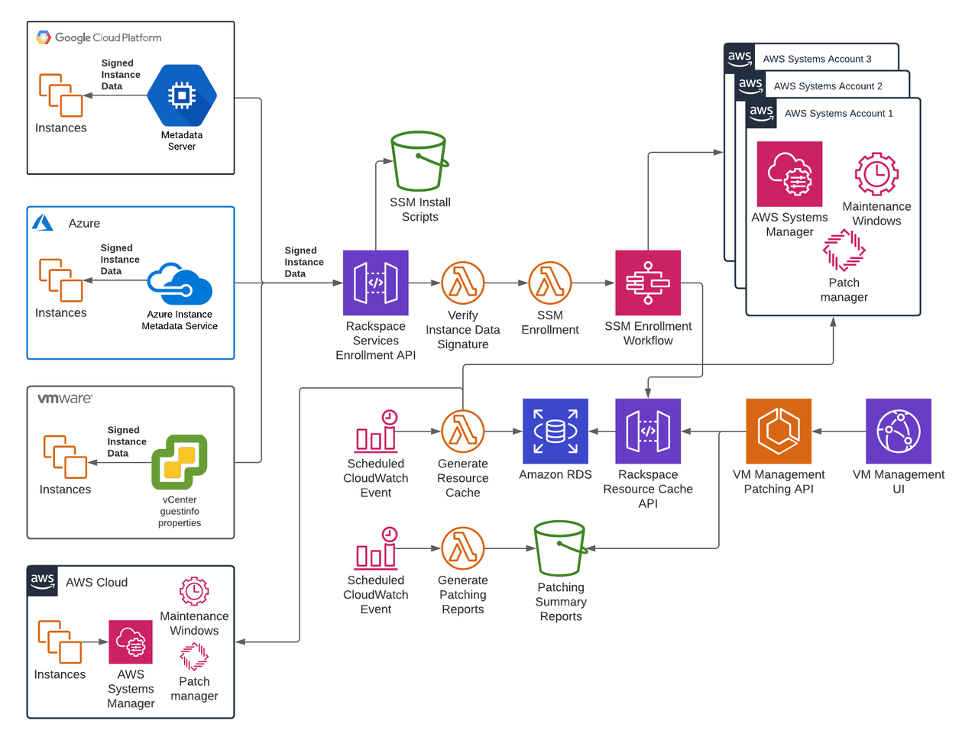
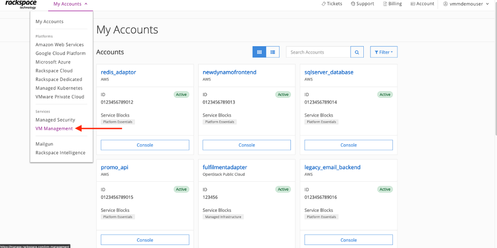
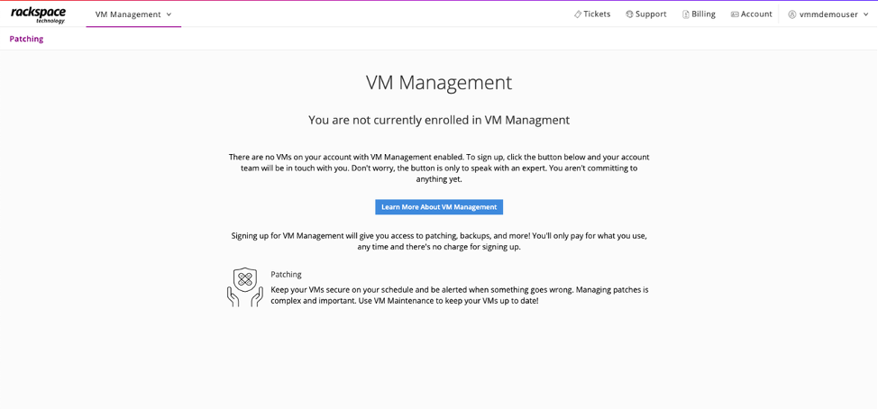
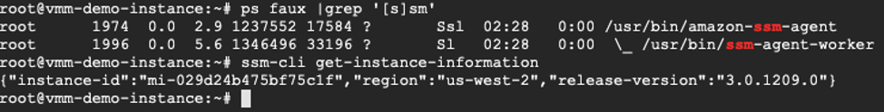
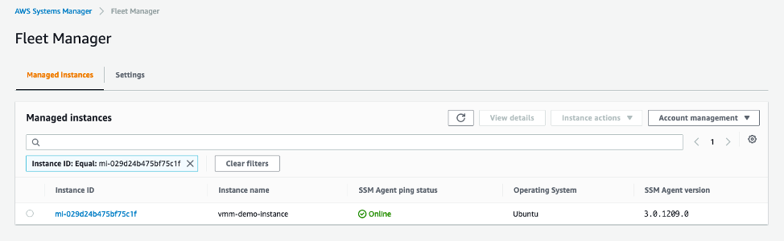
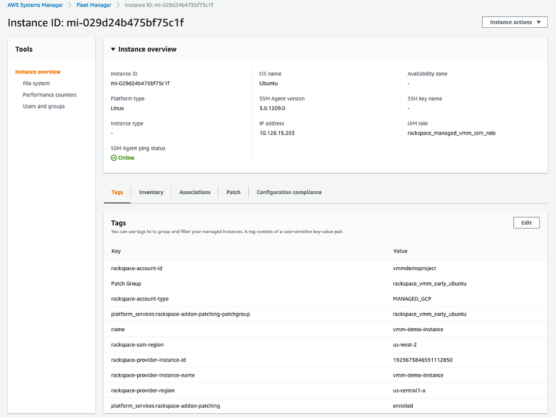
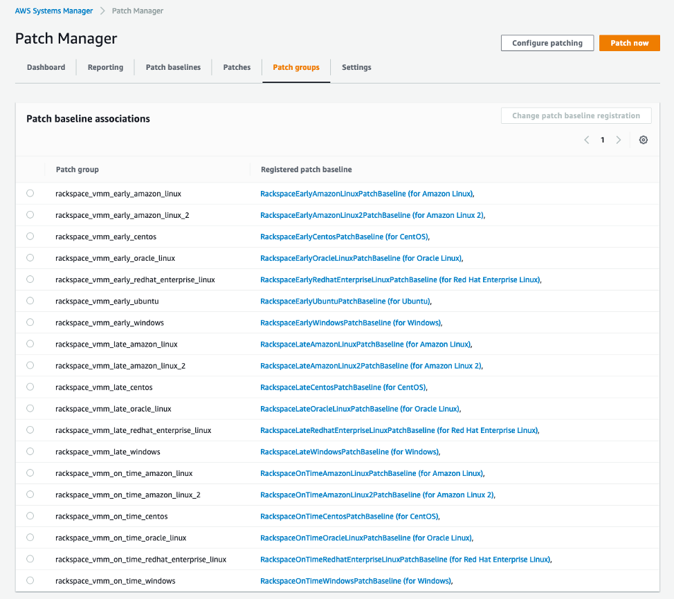
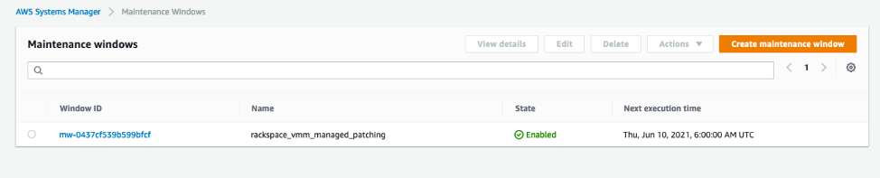
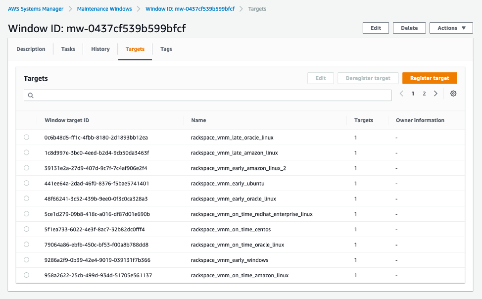
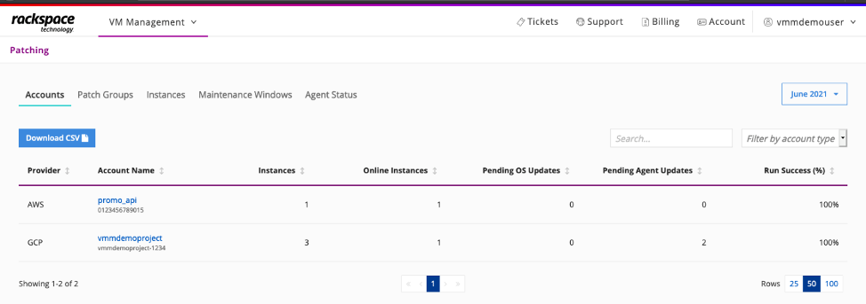

Now that cloud technology has become ubiquitous, companies have many options for hosting 
servers and building out solutions. From the use of multiple cloud providers to bare metal devices to private cloud, or even 
to on-premises resources, <a href="https://www.rackspace.com/">Rackspace</a> engages with customers across a diverse portfolio of 
providers. The customer’s structure can stem from a business need (for example, an interest 
in diversifying their cloud presence). Or it might be due to the early stage of their 
migration to a cloud environment. The customer might be waiting for their on-premises 
contracts to end. No matter the reason, customers commonly ask the same question: How can 
we consolidate our patching across multiple cloud platforms and hybrid and on-premises 
environments? 

<!--more-->

In multi-platform situations, managing virtual machines (VMs) across each platform can be 
tedious and time-consuming. In many cases, administrators must use Secure Shell (SSH) or 
Remote Desktop Protocol (RDP) to connect to each instance or VM on each platform on a 
scheduled basis to perform patching, maintenance, or upgrades. Something as minor as 
applying an update can take hours. These manual processes are also error-prone and can 
result in accidental misconfiguration. Companies that rely on manual processes can also 
wind up creating a knowledge gap in which only a select group of employees know how to 
perform the steps in the process. It works against modern DevOps practices. All of these 
issues combine to increase risks to a company’s security and operational health.

Rackspace is an <a href="https://partners.amazonaws.com/partners/001E0000018XK6cIAG/Rackspace">AWS Premier Consulting Partner</a> with seven <a hreft="https://aws.amazon.com/partners/programs/competencies/">AWS Competencies</a>, including 
Migration and DevOps. As a member of the <a href="https://aws.amazon.com/partners/programs/msp/">AWS Managed Services Provider (MSP) Program</a> and 
the <a href="https://aws.amazon.com/partners/programs/well-architected/">AWS Well-Architected Partner Program</a>, Rackspace is often tasked with creating solutions 
to fit the unique and evolving needs of customers. 

In this post, we explain how Rackspace uses <a href="https://aws.amazon.com/systems-manager/">AWS Systems Manager (SSM)</a> for consolidated 
management and patching across multiple platforms to provide support for all hosting 
strategies. Using Systems Manager reduces the time, effort, and risks commonly associated 
with more manual processes.

### Interact, track, and resolve operational issues with AWS Systems Manager 

The <a href="https://docs.aws.amazon.com/systems-manager/latest/userguide/ssm-agent.html">Systems Manager Agent</a> is Amazon software that can be installed and configured on an 
<a href="https://aws.amazon.com/ec2/">Amazon Elastic Compute Cloud</a> (Amazon EC2) instance, an on-premises server, or a VM. The 
SSM Agent makes it possible for Systems Manager to update, manage, and configure the 
resources that it is installed on. It pulls requests sent to Systems Manager and then 
runs them as specified based on the request. When the operation is complete, the SSM Agent 
sends status and execution information back to <a href="https://docs.aws.amazon.com/systems-manager/latest/userguide/sysman-install-ssm-agent.html">Systems Manager</a>.

Rackspace uses other Systems Manager features, such as <a href="https://docs.aws.amazon.com/systems-manager/latest/userguide/session-manager.html">Session Manager</a> and <a href="https://docs.aws.amazon.com/systems-manager/latest/userguide/systems-manager-patch.html">Patch Manager</a>, 
to provide remote access and automation for customers without the need for direct network 
access. For patching automation, Rackspace uses built-in patch management features like 
<a href="https://docs.aws.amazon.com/systems-manager/latest/userguide/about-patch-baselines.html">patch baselines</a> and <a href="https://docs.aws.amazon.com/systems-manager/latest/userguide/sysman-patch-patchgroups.html">patch groups</a> to control which patches are applied to which instances 
and <a href="https://docs.aws.amazon.com/systems-manager/latest/userguide/systems-manager-maintenance.html">maintenance windows</a> to control when these changes occur. These Systems Manager 
features come together to provide a centralized source of data about a customer’s patching 
experience that can be used to provide customized views and reporting across their entire 
landscape.

### Design considerations

Although the installation, configuration, and activation of the SSM Agent is simple, 
orchestrating this SSM agent setup process across numerous disparate platforms with 
varying features raised some interesting design considerations.

First, to ensure that the SSM Agent activation requests received by Rackspace could be 
verifiably traced to a customer, Rackspace had to design a method for gathering metadata 
from each VM during enrollment. They used metadata services from Microsoft Azure and 
Google Cloud Platform. These services, like the <a href="https://docs.aws.amazon.com/AWSEC2/latest/UserGuide/configuring-instance-metadata-service.html">instance metadata service</a> in Amazon EC2, 
provide signed data to a VM that includes the instance ID, project or subscription ID, 
and so on. During the SSM Agent installation and registration process, that instance 
data is captured and sent to Rackspace as part of the SSM Agent activation request. The 
signed information is verified, which allows the request to be traced back to a customer. 
For VMware, Rackspace developed a similar solution that uses a signed JWT stored in 
vCenter that is fetched during the installation process. 

Figure 1 shows the entire architecture:

{{}}
<i>Figure 1: Centralized management of multi-cloud and multi-platform instances through 
Rackspace and Systems Manager</i>

Next, Rackspace needed to devise a solution to properly handle managed instances from 
different customers. One idea was to use a single AWS account to host managed instances 
for all customers, but this approach raised security and operational concerns. Rackspace 
decided to partition each customer’s account into a separate AWS account for all Systems 
Manager resources (known as a systems account). Thus, each Google Cloud Platform, Azure, 
and VMware account is assigned its own AWS systems account. The account is created 
transparently, in the background, when a registration event is received. This approach 
offers more access control, partitioning, and flexibility for each account. 

Since Rackspace rolled out this capability for VMware private cloud, VMware Cloud on AWS, 
native AWS customers, and Google Cloud Platform customers, it has increased operational 
security and efficiency for customers.

### Consolidated management and patching

To take advantage of consolidated management and patching, sign in to your Rackspace 
account at https://manage.rackspace.com and navigate to the VM Management portal to enroll. 

{{}}
<1>Figure 2: VM Management from Rackspace portal</i>

If you aren’t already enrolled, you will see the following:

{{}}
<i>Figure 3: VM Management page for Rackspace account enrollment</i>

Choose the Learn More About VM Management button. Your Rackspace account team will contact 
you to discuss your patching requirements and the onboarding process. In most cases, 
you’ll receive a link to a startup script that installs and activates the SSM Agent on VMs. 
For native EC2 instances, the SSM Agent is already installed. (It is already installed on 
many AMIs, so no installation script is required.) If you are using a custom AMI that does 
not have the SSM Agent installed, you will need to install it or build it into your AMI 
before you enroll in VM Management. 

For more information, including how to install SSM Agent manually, check <a href="https://docs.aws.amazon.com/systems-manager/latest/userguide/prereqs-ssm-agent.html">About SSM Agent</a>. 
Rackspace will need to verify or help you configure some networking and operating system 
requirements for Systems Manager. For more information, see <a href="https://docs.aws.amazon.com/systems-manager/latest/userguide/systems-manager-prereqs.html#prereqs-ssm-agent">Systems Manager prerequisites</a> 
and <a href="https://docs.aws.amazon.com/systems-manager/latest/userguide/patch-manager-prerequisites.html">Patch Manager prerequisites</a>.

### End-to-end solution powered by AWS Systems Manager  

After you have enrolled in Rackspace VM Management, you can create an instance and register 
it for patching. For most platforms, you use the startup script and the cloud platform’s 
native tagging functionality (for example, EC2 tags, Google Cloud Platform VM labels, and 
Azure VM tags). 

The registration process captures information about the instance and communicates it to 
Rackspace’s VM Management service. If this is the first registration for the account, the 
service transparently creates the systems account that will house all SSM-related 
resources for the linked customer account. After the systems account is set up, the 
service configures SSM on that account and passes the registration information to the 
startup script on the VM to finalize the SSM Agent installation. You can now manage the 
VM for multiple services through SSM. 

Here is the step-by-step process that serves as a demonstration of what happens behind 
the scenes:

1.	Create an instance and specify the appropriate startup script and tags provided during 
the enrollment process. This example uses a GCP instance, but there are other options 
available such as AWS EC2 instances. For GCP, adding the “startup-script-url” metadata 
ensures that the SSM install script is executed when the GCP instance boots. In addition, 
setting the “rackspace-addon-patching” label to “true” causes Rackspace’s automation to 
configure patching resources on the AWS systems account. The “rackspace-addon-patching-patchgroup” 
label defined what patch group this VM should be enrolled in, if it is not provided, 
the VM will be enrolled in a default patch group.

{{}}
<i>Figure 4: Create an instance in Google Cloud Platform</i>

2.	The SSM Agent is installed on the instance and activated in the systems account. The 
patch group defined in the “rackspace-addon-patching-patchgroup” label on the GCP VM is 
copied over to the Patch Group tag on the managed instance. The Patch Group tag links the 
VM to a specific patch baseline that indicates what patches are installed.

{{}}
<i>Figure 5: SSM Agent </i>

{{}}
<i>Figure 6: Fleet Manager in AWS Systems Manager of systems account</i>

{{}}
<i>Figure 7: Managed instance in Systems Manager console</i>

3.	Rackspace’s automation sets up Systems Manager options like maintenance windows, targets, 
inventory, and custom patch baselines on the AWS systems account. By default, custom patch 
baselines are created for Windows, Ubuntu, Debian, CentOS, Red Hat Enterprise Linux, 
Oracle Linux, Amazon Linux, and Amazon Linux 2. In addition, default patch groups are 
created that correspond to the age of patches installed – “early” for patches that are 
0 or more days old, “on-time” for patches that are 7 or more days old, and “late” for 
patches that are 14 or more days old. 

{{}}
<i>Figure 8: Patch baseline associations in the Systems Manager console </i>

{{}}
<i>Figure 9: Maintenance window in the Systems Manager console</i>

{{}}
<i>Figure 10: Targets in the Systems Manager console</i>

4.	The managed instance is displayed in Rackspace’s interface. You get a consolidated view of the instances and information, such as which patch was applied, its version, and so on.

{{}}
<i>Figure 11: Consolidated view of patching across platforms on Rackspace site</i>

{{}}
<i>Figure 12: Detailed view of patch activity per instance on Rackspace site</i>

### Conclusion
Rackspace now offers a solution for you to manage the patching and maintenance of instances across multiple platforms. To learn more about how Rackspace can help you with business challenges related to management and governance, visit the Rackspace VM Management and AWS Systems Manager webpage.

<a class="cta purple" id="cta" href="https://www.rackspace.com/lp/vmm">Learn about Rackspace VM Management.</a>

<a class="cta purple" id="cta" href="https://aws.amazon.com/systems-manager">Learn about AWS Systems Manager.</a>

Use the Feedback tab to make any comments or ask questions. You can also
[start a conversation with us](https://www.rackspace.com/contact).
