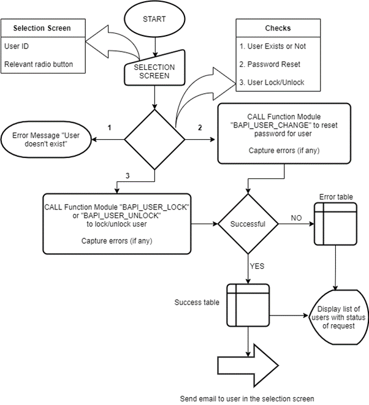
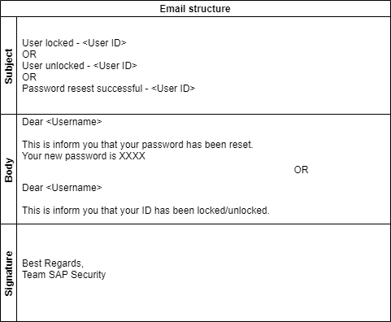

It all started with a discussion with one of my colleagues who is working as an SAP security consultant.

<!--more-->

During the  discussion, I realized that they get multiple requests for resetting passwords and locking or unlocking of users, which consumes a good amount of their time. By the time the discussion ended, I thought of creating a program/tool to automate these requests to save time for other productive tasks.

I have discussed the steps to automate in this blog. 

### Input for the program
There are two inputs:

 - _User ID_ - This is to get User ID for which action to be taken. Tool can get multiple User IDs at a time.
- _Radio Buttons_ (Password Reset, User Lock, User Unlock) - This is to give options to user to select relevant action to be taken.

### Output of the program

•	Output will have a list of all the User IDs passed in the selection screen and a status for each User ID showing if the request has been completed or not.

•	Program will also trigger emails to users individually to let them know the new password or update them about their user status.

Now, let's see the logic behind this program. I have created a flow diagram for it to have a better understanding. 

### Program Logic

Image 1: Flow Diagram of logic (Designed via draw.io)

_**Note_: Email IDs  of the users will be captured from user data (Tables: USR21 & ADR6)
In-case email id is not maintained in user data, email will be sent to the person running this program.

#### 1. Declare the service or platform through code

Tools, such as Kustomize&reg;, Helm&reg;, Terraform&reg;, and Ansible&reg;,
declare services and platforms through configuration languages. You store the
repository for the templates and manifests in a git-based source control system
to enable a single source of truth for DevOps or SRE teams.

#### Function modules used inside the program:

•	BAPI_USER_CHANGE - To change/reset password

•	BAPI_USER_LOCK - To lock the user

•	BAPI_USER_UNLOCK - To unlock the user

#### Class used inside the program:

To trigger emails, CL_BCS class is used.

### Email Structure:

Image 2: Email structure (Designed via draw.io)

#### 4. Authorization:

Only SAP Security Team or immediate managers would be authorized to use this program.

### References:
Nothing as such, just self-exploring was sufficient to ideate and implement this tool.
Draw.io was used to design flow diagram.
