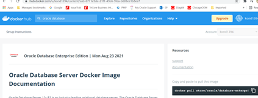
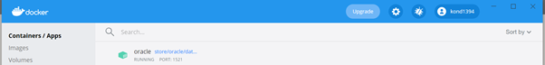

Docker is designed to run on Linux kernel version 3.8 and higher.

<!--more-->

### Features of Docker

- You can deploy Docker containers on any physical and virtual machines and on the cloud.

- Docker containers are lightweight, and easily scalable. 

- It becomes easy for developers to work smoothly and build applications.
- As Dockers are platform independent, they can be deployed on windows/Linux/Mac OS.

### Docker Engine

It is a key component in CMS and used for building docker images (12c in our case, need to download from docker hub) and create docker containers.

_NOTE:Dockers are alternative to Virtual machines._

A virtual machine relies on the system’s physical hardware to emulate the exact same environment on which you install your applications. 
We install hypervisor on Operating system and build different VMS to build application.
Docker is a stand-alone piece of software that includes everything needed to run it.

### Docker Architecture

_Image Source_ : https://www.docker.com/resources/what-container

Docker’s architecture is also client-server based and more complicated than VM.

### The architecture consists of the following four parts:
========================================

_Docker Client_: Used to interact with your containers.

_Docker Objects_: Containers and images. As mentioned earlier, containers are the placeholders for your software, and can be read and written to. Container images are read-only and used for creating new containers.

_Docker Daemon_: A background process responsible for receiving commands and passing them to the containers via command line.

_Docker Registry_: It is nothing but Docker Hub where it stores container images.

### Advantages of Docker Containers:

It doesn’t require hardware hypervisor. This means docker containers are much smaller and require less resources.
Dockers reboot much faster in comparison to VMS.

### Install 12cdatabase on docker.

#### High level steps 

1) You	need to install docker software for windows/linux/Mac Os and run it. 
 https://hub.docker.com/ and download docker for windows.

You need to restart the system to complete installation.

2) Set up docker hub account to download docker image files that support 12.1.0.2 database.

3) Extract Oracle image

4) Connect using command prompt.

### Step by step approach to install 12c database

#### 1)	 Post downloading containers for windows, run the executable file., Once done, the docker container will open. 

#### 2) Copy the above command and paste it on the command prompt to ensure that the container continues to run.

Hence `C:\Users\****>docker run -d -p 80:80 docker/getting-started`
`Unable to find image 'docker/getting-started:latest' locally`
`latest: Pulling from docker/getting-started`
`540db60ca938: Pull complete`
`0ae30075c5da: Pull complete`
`Status: Downloaded newer image for docker/getting-started:latest`
`769c5cbc827acc1f9896cd4fd8511ec6b9eb9822bd9e56f2d161bcf1c9a7b82c`
`C:\Users\*****>docker login`

Login with your Docker ID to push and pull images from the Docker Hub. If you don't have a Docker ID, click on the following link to create one: https://hub.docker.com .

Username: konda321

Password:Sreeharsha****b2

Login Succeeded

#### 3)	Now login into docker hub and get the 12c image.

_Copy and paste the command on command prompt_

`Full database - doc2ker pull store/oracle/database-enterprise:12.2.0.1`
`Slim database - docker pull store/oracle/database-enterprise:12.2.0.1-slim`  
`C:\Users\****>docker pull store/oracle/database-enterprise:12.2.0.1-slim`
`12.2.0.1-slim: Pulling from store/oracle/database-enterprise`
`Digest:sha256:dbd87ae4cc3425dea7ba3d3f34e062cbd0afa89aed2c3f3d47ceb5213cc0359a`
`Status: Downloaded newer image for store/oracle/`
`database-enterprise:12.2.0.1-slim`
`docker.io/store/oracle/database-enterprise:12.2.0.1-slim`

#### 4. Once image downloaded. Then run it with docker run.
`C:\Users\***>docker run -d -p 1521:1521 --name oracle store/oracle`
`database-enterprise:12.2.0.1-slim`
`fe350459c427436a0f6b4418bf7296db7f80e0dac02ff0141c373944034cafcf`

#### 5. Once done start the database
`C:\Users\***>docker start oracle Oracle`

#### 6. Check the containers.
`C:\Users\***>docker ps`
`CONTAINER ID   IMAGE`                                            `COMMAND                  CREATED `         `STATUS`                   `PORTS                                                 NAMES`
`fe350459c427   store/oracle/database-enterprise:12.2.0.1-slim` 
`  "/bin/sh -c '/bin/ba…"   58 seconds ago   Up 57 seconds (health:` `starting)   0.0.0.0:1521->1521/tcp, :::1521->1521/tcp, 5500/tcp`   `oracle`
`769c5cbc827a   docker/getting-started                           "/`
`docker-entrypoint.…"   17 minutes ago   Up 17` `minutes                      0.0.0.0:80->80/tcp, :::80->80/`
`tcp                     festive_diffie`

We can see the same on docker desktop

#### 7. Now connect to the database.

`C:\Users\****>docker exec -it oracle bash -c "source /home/oracle/.`

`bashrc; sqlplus /nolog"`

`SQL*Plus: Release 12.2.0.1.0 Production on Wed Aug 25 10:49:06 2021`

`Copyright (c) 1982, 2016, Oracle. All rights reserved.`

`SQL> select name from v$database;`

`SP2-0640: Not connected`

`SQL> connect sys as sysdba`

`Enter password: Oradoc_db1  >> Default password.`

`Connected.`

`SQL> select name from v$database;`

Name---------
`ORCLCDB`
`SQL> show pdbs;`
`    CON_ID CON_NAME                       OPEN MODE  RESTRICTED`
---------- ------------------------------ ---------- ----------
 `        2 PDB$SEED                       READ ONLY  NO`

`         3 ORCLPDB1                       READ WRITE NO`

### Conclusion

 A Container’s goal is to isolate an application and to remove the need of physical hardware by allowing for more efficient use of computing resources, both in terms of energy consumption and cost effectiveness.

 
<a class="cta purple" id="cta" href="https://www.rackspace.com/data/managed-sql">Learn about Rackspace Managed SQL Databases.</a>

<a class="cta purple" id="cta" href="https://www.rackspace.com/data/databases"> Learn about Rackspace Database Services.</a>

Use the Feedback tab to make any comments or ask questions. You can also
[start a conversation with us](https://www.rackspace.com/contact).