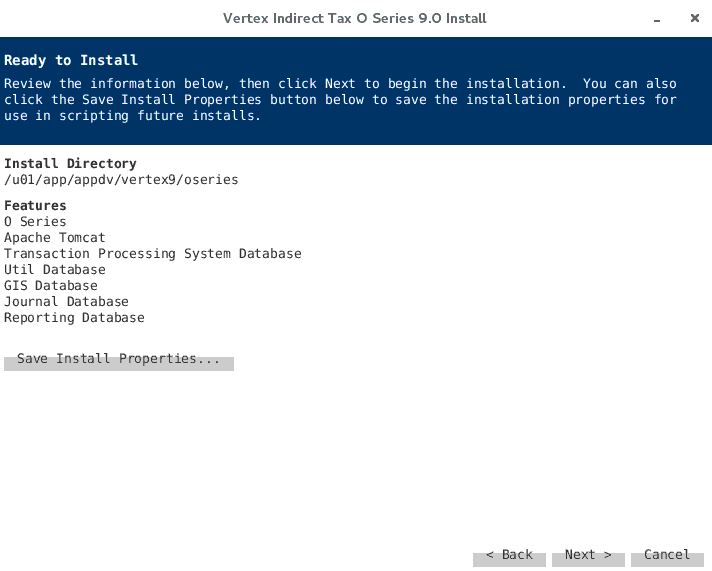

Vertex solutions help Oracle customers streamline and integrate tax provision and compliance processes, and leverage information to discover new, strategic tax savings across every major line of business tax, including income, sales, consumer use, value added, communications, and payroll.
<!--more-->

Vertex can be used with Oracle application software to calculate tax. Here is the vertex 9 software we used to install and upgrade from vertex 7
In Part 1, I have explained about the steps for installing the verex9 software.
Part 2 explains the upgrade of software from vertex 7 to vertex 9. 

Instance used for vertex9 installation is DTRXI R12.2 instance. Following is the server details using for vertex.

_Database Node_	nchltrxddb01.tcs.terex.com

_Vertex9 Application Nodes_ 	nchltrxdvrtx01.tcs.terex.com

### PART 1: Installation of Vertex 9 for EBS R12.2

The following steps explain about how to install vertex9 software for Oracle Applications version R12.2.

#### 1) Creation of VERTEX9 in database.

`CREATE TABLESPACE VERTEX9 DATAFILE '+DTRXI_DATA' SIZE 104857600 REUSE AUTOEXTEND ON` `NEXT 104857600 MAXSIZE 32767M EXTENT MANAGEMENT LOCAL AUTOALLOCATE SEGMENT SPACE MANAGEMENT AUTO;`

#### Add 4 datafiles in TABLESPACE VERTEX9

`alter tablespace VERTEX9 add datafile '+DTRXI_DATA' SIZE 104857600 REUSE AUTOEXTEND ON NEXT 104857600 MAXSIZE 32767M;`

`alter tablespace VERTEX9 add datafile '+DTRXI_DATA' SIZE 104857600 REUSE AUTOEXTEND ON NEXT 104857600 MAXSIZE 32767M;`

`alter tablespace VERTEX9 add datafile '+DTRXI_DATA' SIZE 104857600 REUSE AUTOEXTEND ON NEXT 104857600 MAXSIZE 32767M;`

`alter tablespace VERTEX9 add datafile '+DTRXI_DATA' SIZE 104857600 REUSE AUTOEXTEND ON NEXT 104857600 MAXSIZE 32767M;`

#### Create VERTEX9 and VREP9 and VERTEX8
`CREATE USER VERTEX8 IDENTIFIED BY xxx DEFAULT TABLESPACE VERTEX9 TEMPORARY TABLESPACE TEMP;`

`CREATE USER VERTEX9 IDENTIFIED BY xxx DEFAULT TABLESPACE VERTEX9 TEMPORARY TABLESPACE TEMP;`

`Create user VREP9 identified rby xxx DEFAULT TABLESPACE VERTEX9 TEMPORARY TABLESPACE TEMP;`

#### Provide required grants and quota
`grant create session,create any view, resource to vertex8;`

`alter user vertex8 quota unlimited on vertex9;`

`grant create session,create any view, resource to vertex9;`

`grant CREATE SESSION,create any view, resource to vrep9;`

`alter user vertex9 quota unlimited on vertex9;`

`alter user  vrep9 quota unlimited on vertex9;`

### STEP 2: Start the VERTEX 9 installation:

_Server name:_	nchltrxdvrtx01.tcs.terex.com

_Note : Download and keep software and jdk1.8.0_144 ready for installation on server_
._This need to be done on all the servers where tomcat needs to be installed._

##### 1) Create oseries directory.
`cd /u01/app/appdv`
`mkdir -p vertex9/oseries`
##### 2) Copy the jdk-8u144-linux-x64.tar.gz and software folder from nchltrxdvrtx01under /u01/app/appdv directory if it is not available.

##### 3) Untar the java file, export some parameters and start installation.
`Cd /patch/stage/shared/vertex_9`
`cp Vertex_license_9.0.dat license.dat`
`mkdir v9_installer`
`cp o-series-9.0-programs-indirect-tax-9.0.0.0.321.zip v9_instaler`
`unzip o-series-9.0-programs-indirect-tax-9.0.0.0.321.zip `
`cd /u01/app/appdv`
`java -version`
`cd /patch/stage/shared/vertex_9/v9_instaler`
`java -jar vertex-o-series-install-9.0.0.0.321.jar`

##### Step 1: You can select the features to install.  	

##### Step 2: OSeries  Install directory

##### Step 3: Provide the JDK location where the java extracted 
_Note: Maximum memory should be “6144”_

##### Step 4: You can choose Admin password here.

##### Step 5: For Journal database and transactional processing system database  we have to select Oracle database and user, schema name as vertex9

_Note: you can select the connection information for util and GIS_.

##### Step 6: For reporting Database we have to select Oracle database and user, schema name as `vrep9`

##### Step 7: Provide license file location.

##### Step 8:You can see below screen before install. 

### STEP 3: Apply patch for Vertex:

_This need to be done on all the servers where tomcat is installed in multi node environment.  If this license file is not copied then Patch will fail and we need to restart from Step-2 onwards. License file you can get from client._

##### 1) Before Applying Patch, we need to copy license.bat file from software location if required.
`Cd /u01/app/appdv/vertex9/oseries`
`ls -lrt  license.dat`
##### 2) Copy the patch, unzip and apply it.
`cd /u01/app/appdv/vertex9/oseries/patch`
`cp /patch/stage/shared/vertex_9/o-series-patch-indirect-tax-9.0.1.1.29.zip .`
`echo $PATH`
`/u01/app/appdv/jdk1.8.0_144/bin:/usr/local/bin:/usr/bin:/usr/local/sbin:/usr/sbin:`/`home/appdv/.local/bin:/home/appdv/bin`
`java -jar vertex-o-series-patch-9.0.1.1.29.jar`

##### 3) Copy the datapatch.
`[appdv@nchltrxdvrtx01 dataupdate]$ cd /u01/app/appdv/vertex9/oseries/dataupdate`
`[appdv@nchltrxdvrtx01 dataupdate]$ cp /patch/stage/shared/vertex_9/O_9.0_update_198f.zip .`
`[appdv@nchltrxdvrtx01 dataupdate]$ ls -lrt`
`-rwxrwxr-x 1 appdv appdv 363763438 May 26 17:34 O_9.0_update_198f.zip`
`[appdv@nchltrxdvrtx01 dataupdate]$`

### STEP 4 : Update the vertex.cfg file

##### 1) Go to below location.

`Cd /u01/app/appdv/vertex9/oseries/config`
`cp -rp vertex.cfg vertex.cfg_bkp_26may20`

##### 2) Add the below steps in vertex.cfg.
`upgrade.UniqueIdStartValue=120000000` – This value should be on top of the file.
`AllowHistoricalEdits=true`
`tps.common.domain.force_distributetax_on_failure.supplies=true`
`taxgis.jurisdictionfinder.ToApproximateTaxAreasHistorically=true`
`taxgis.jurisdictionfinder.AlternativeRegionTypeLists_USA=COUNTRY;MAIN_DIVISION`;`SUB_DIVISION;CITY;ZIP5|COUNTRY;MAIN_DIVISION;CITY;ZIP5`
`tps.common.domain.assumeVendorRegistrationForInvoiceVerification_CAN=true`
`tps.common.domain.assumeVendorRegistrationForInvoiceVerification_USA=true`

### STEP 5: Start the Tomcat Services:

##### 1) Go to the below location.
`Cd /u01/app/appdv/vertex9/oseries/tomcat/bin`

##### 2) Start the tomcat services.
`./startup.sh`

##### 3) Check the services as below.
`[appdv@nchltrxdvrtx01 bin]$ ps -ef | grep appdv | grep java`

### STEP 6: Download the data patch updates and copy to the dataupdate location.

_This step:6 need to be done on all the servers where tomcat is installed._ 

This version need to be checked again in vertex 7:
`Cd /u01/app/appdv/vertex9/oseries/dataupdate`
`cp /patch/stage/shared/vertex_9/O_9.0_update_198f.zip .`
_NOTE: Do not unzip the file._

### STEP 7: Run the data update:

_Dataupdate:_

##### Step 1: Log in the url: http://nchltrxdvrtx01.tcs.terex.com:9095/oseries-ui/
`Username:` `admin`                                                                              `Password:  xxxxx`

##### Step 2: System>Data Management

##### Step 3: Click on Data Update
##### Step 4: Click on update Files search
##### Step 5: Select the files need to update and then Run it.
##### Step 6: You can see below screen once update completed. 

### Conclusion

This concluded Part 1. We will now learn to upgrade and integrate the same with Oracle Applications R12.2 in Part 2.  

<a class="cta purple" id="cta" href="https://www.rackspace.com/applications/oracle">Learn about Rackspace Managed Services for Oracle Applications.</a>

<a class="cta purple" id="cta" href="https://www.rackspace.com/applications/application-modernization"> Learn about Rackspace Aplication Modernization Services.</a>

Use the Feedback tab to make any comments or ask questions. You can also
[start a conversation with us](https://www.rackspace.com/contact).
