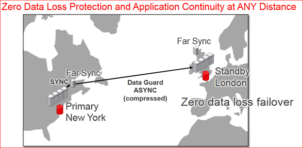

A remote Oracle Data Guard instance sometimes receives redo data from its primary database, and then, sends that redo data to the other member(s) of the Oracle Data Guard configuration. This activity consumes very little resources in terms of disk space and processing
<!--more-->

 It also offloads a very major overhead from a primary database i.e. redo transport.   
Like a Standby Database, an Oracle Data Guard Far Sync instance has a Control file and Standby redo logs. These are used for receiving redo and create local archived redo logs from a local standby redo log. Starting from this point, the differences between a Standby Database and Far Sync Instance kicks in. Like a Standby Database, this instance does not have database files, and is unable to perform redo apply. Due to this, Far-Sync Instance never functions  as a primary database nor gets converted into standby database of any type. 
To use Far sync instance, which is a part of Oracle Active Data Guard Far Sync feature, one requires Oracle Active Data Guard license. 
A primary database fully utilizes the redo transport option while communicating with Far Sync instance, like a typical standby destination. Likewise, a Far Sync instance can use any kind of redo transport options while communicating with terminal standby destinations (e.g. performing redo transport compression, provides you with a license for the Oracle Advanced Compression and others).
In many Primary-Standby Database configurations, primary database ships redo to a standby database via asynchronous transport option. In this type of config setting, there is a high risk of data loss during database failover scenario. 

To ensure zero data-loss, if synchronous redo transport setup is used then it may not be a feasible option because commit response may have some impact at the primary, due to network latency between primary and standby.
At this point, Far Sync instance plays a vital role. Far sync instance resides close to a Primary Database. This minimizes the impact of on/off  commit response time up to an acceptable time-threshold. The distance between Far Sync instance and Primary database always be within a smaller and an acceptable network latency time. This setup provides a better data protection. In case primary fails, assuming that the Far Sync instance was completely in-sync with the Primary at the time of failure, the Far Sync will start coordinating with the standby database(s) and migrate the final redo logs to standbys, which are not yet synced with Far Sync. This final redo logs shipping then makes the standby database(s) completely synched with failed primary. This is known as “zero-data-loss” scenario followed by a good failover to standby.

Image Source: https://Oracle.com

 

 

### Building a Far Sync Instance

	As the Far Sync instance does not have datafiles, you are not required to copy or restore datafiles from backup to Far Sync site. Far Sync instance has been created in the maximum availability mode with synchronous redo transport from primary and asynchronous redo transport from Far Sync to a standby database in real time.  The standby databases need to be configured as an alternate destination of the Far Sync instance in case of communication interruption between Primary and the Far Sync instance. You must ensure a direct connection between primary and standby databases to perform routine health checks and failover/switchover tasks. This link shouldn't be used for redo transport unless standby is configured as an alternate destination to Far Sync instance. In case, Far Sync fails there is no other Far Sync instance available.

#### Steps to create a Far Sync Instance

a)	Create Control file for far sync instance (Primary Database must be at least in mount state)

b)	Create parameter file (with necessary modifications e.g. `DB_FILE_NAME_CONVERT`, `LOG_FILE_NAME_CONVERT`,` DB_UNIQUE_NAME` etc.

c)	Create standby redo logs, as they are created for a regular standby database. 

d)	Copy-n-create remote login password file 

e)	Create-n-configure Database listener at Far Sync instance site.

f)	Create a network service name at primary site to connect Far Sync site to transport the redo and vice-versa.

g)	Create a network service name at Far Sync to connect standby database, to transport the redo.

### Alternate Destinations

From Oracle Database 12c R2 onwards, the "Priority" and "Group" attributes have been replaced with "Alternate" attribute for remote redo transport destination. To maintain and protect the zero-data-loss configuration, in case of Far Sync instance fails, Alternate redo transport attribute to standby databases must be configured.
The number of available alternate remote destination(s) can be increased using log archive destination groups, it specifies multiple destinations which can be used to transport redo to multiple locations. With one active destination at a time on primary database, rest only become active if first active becomes unavailable.

### Far Sync Instance - High Availability
To ensure more protection from system or network failures, you can opt for building additional Far Sync instances to provide high availability for the active Far Sync instances. This setup will have a preferred active Far Sync instance and remaining will work as an alternate for the main Far Sync instance. This setup ensures maximum availability.  In case, the first preferred Far Sync instance fails due to any reason, then the Primary database starts migrating redo to the alternate Far Sync instances. 

### Supported Protection Modes for Far Sync Instances  

There are two types of protection mode available in the Far Sync instance configuration:
a)	Maximum Availability Mode: In this mode, Far Sync instance resides comparatively closer to the primary database to reduce network latency. This mode uses Synchronous transport as a primary service for redo transport.

b)	Maximum Performance Mode: In this mode, primary database uses the asynchronous redo primary service to the Far Sync instance destination for redo transport. Regardless of the physical distance between Far Sync and the primary instance, the high network latencies do not impact redo tractions if remote destination uses the asynchronous transport. A Far Sync instance can provide more benefits to Oracle Data Guard configurations which have more than one remote destination. Almost zero-incremental effect for every remote destination adds to the Data Guard configuration. A Far Sync instance also takes care of a redo transport compression and offloads it from a primary including serving the rest of the standbys in the configuration. To achieve better performance, you need to ensure that the number of destinations is high.

### Advantages of Far Sync Instance

-	A very light-weighted standby instance.
-	It only maintains instances i.e. parameter file with control file and SRLs, No Datafiles.
-	Due to this it consumes very low server resources i.e. CPU, Memory, I/O etc.
-	No Network latency issues even synchronous redo shipping.
-	Always gives Zero-Data-Loss Guarantee. 
-	Should be close to the Primary site, with-in 40-150 miles, on higher bandwidth network link.
-	No Physical Structure in terms of Database.
-	Active-n-alternate Far sync instances can be configured. 
-	Maximum of 29 Remote Standby databases can be supported.

<a class="cta red" id="cta" href="https://www.rackspace.com/data/managed-sql">Let our experts guide you on your Managed SQL journey.</a>

Use the Feedback tab to make any comments or ask questions. You can also
[start a conversation with us](https://www.rackspace.com/contact).
